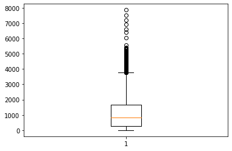
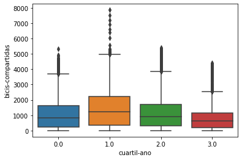
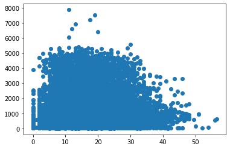
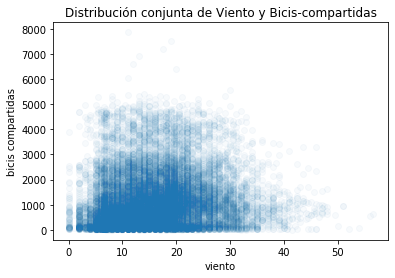

```python
import scipy.stats
import numpy as np
import pandas as pd

import matplotlib.pyplot as plt
import seaborn as sns

%matplotlib inline
```


```python
df = pd.read_csv('bicicletas-compartidas.csv')
```


```python
df.columns
```


    Index(['fecha', 'bicis-compartidas', 'temp-obs', 'sens-temp', 'hum', 'viento',
           'codigo-clima', 'festivo', 'findesemana', 'cuartil-ano'],
          dtype='object')


```python
y = df['bicis-compartidas']
fig, axis = plt.subplots()
axis.boxplot(x = y)
# La línea inferior indica dónde inicia (0)
# El primer cuartil, es la línea donde inicia la caja
# El segundo cuartil, la mediana, es la línea amarilla
# El tercer cuartil, donde se cierra la caja
# El cuarto cuartil, la línea horizontal superior
# Y los gráficos circulares son los valores outliers
```


    {'whiskers': [<matplotlib.lines.Line2D at 0x7f6892699f50>,
      <matplotlib.lines.Line2D at 0x7f6893d4b050>],
     'caps': [<matplotlib.lines.Line2D at 0x7f68926bd610>,
      <matplotlib.lines.Line2D at 0x7f68926bdb10>],
     'boxes': [<matplotlib.lines.Line2D at 0x7f6892699f10>],
     'medians': [<matplotlib.lines.Line2D at 0x7f68926abc90>],
     'fliers': [<matplotlib.lines.Line2D at 0x7f6892644650>],
     'means': []}





```python
y = df['bicis-compartidas']
fig, axis = plt.subplots()
sns.boxplot(x = 'cuartil-ano' ,y = 'bicis-compartidas', data = df)
```


    <matplotlib.axes._subplots.AxesSubplot at 0x7f68926033d0>





```python
# Scatterplot
fig, axis = plt.subplots()
axis.scatter(df['viento'], df['bicis-compartidas'])
# Para poder trabajar con un scatterplot, necesitaremos 2 variables continuas.
```


    <matplotlib.collections.PathCollection at 0x7f689253d150>





```python
fig, axis = plt.subplots()
axis.scatter(df['viento'], df['bicis-compartidas'], alpha = 0.03)
axis.set_title('Distribución conjunta de Viento y Bicis-compartidas')
axis.set_xlabel('viento')
axis.set_ylabel('bicis compartidas')
# Alpha ayuda a difuminar los datos
# Scatterplot y boxplot son los 2 gráficos más utilizados en el análisis estadístico, porque nos permite observar la relación que tienen 2 variables.
# Si no encontramos un patrón, podremos decir que las variables no están relacionadas.
# Si encontramos relaciones entre las variables, podemos explorar relaciones más profundas entre estas.
```


    Text(0, 0.5, 'bicis compartidas')




