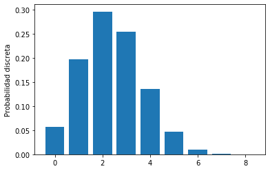
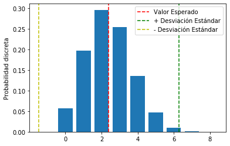

```python
import scipy.stats
import numpy as np
import pandas as pd
import matplotlib.pyplot as plt
import seaborn as sns
%matplotlib inline
```

# Distribuciones de probabilidad discretas


```python
from scipy.stats import binom

p = 0.3
n = 8

x = list(range(0,9,1))
y = list([])

for i in x:
    # binom.pmf: Probability Max Function(i, p = 0, n = n)
    y.append(binom.pmf(i, p=p, n=n))
```


```python
y
```


    [0.05764801000000002,
     0.1976503200000001,
     0.2964754800000002,
     0.25412184,
     0.1361367,
     0.04667544000000001,
     0.010001879999999989,
     0.0012247199999999988,
     6.560999999999994e-05]


```python
fig, axis = plt.subplots()
axis.bar(x,y)
axis.set_ylabel('Probabilidad discreta')
```


    Text(0, 0.5, 'Probabilidad discreta')





```python
np.sum(y)
```


    1.0000000000000002


# A continuación vamos a mapear sobre esta distribución el valor esperado y la desviación estándar de la función


```python
media = np.average(x, weights=y)
media
```


    2.4


```python
varianza = np.average(((x-media)**2), weights = y)
varianza
```


    1.68


```python
media, varianza
```


    (2.4, 1.68)


```python
fig, axis = plt.subplots()
axis.bar(x,y)
axis.set_ylabel('Probabilidad discreta')
axis.axvline(x=media, c='r', linestyle='--', label='Valor Esperado')
axis.axvline(x=media +3*np.sqrt(varianza), c='g', linestyle='--', label='+ Desviación Estándar')
axis.axvline(x=media -3*np.sqrt(varianza), c='y', linestyle='--', label='- Desviación Estándar')
axis.legend()
```


    <matplotlib.legend.Legend at 0x7f36acd44410>




