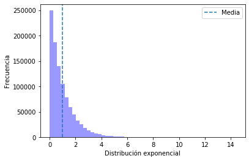
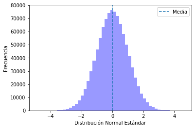
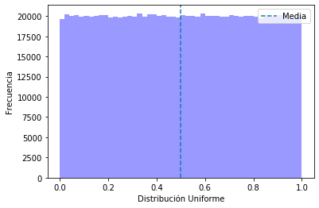

# Distribuciones continuas más utilizadas


```python
import numpy as np
import pandas as pd

import seaborn as sns
import matplotlib.pyplot as plt
%matplotlib inline
```

# Distribución Exponencial


```python
from scipy.stats import expon
data = expon.rvs(size = 1000000)
len(data)
```


    1000000


```python
mean, var, skew, kurt = expon.stats(moments = 'mvsk')
(mean, var, skew, kurt)
```


    (array(1.), array(1.), array(2.), array(6.))


```python
axis = sns.distplot(data, bins = 50, kde = False, color = 'blue')
axis.set(xlabel = 'Distribución exponencial', ylabel = 'Frecuencia')
axis.axvline(x = mean, linestyle = ('--'), label = 'Media')
axis.legend()
```


    <matplotlib.legend.Legend at 0x7f3cd4dff750>





# Distribución Normal


```python
from scipy.stats import norm
data = norm.rvs(size = 1000000)
len(data)
```


    1000000


```python
mean, var, skew, kurt = norm.stats(moments = 'mvsk')
(mean, var, skew, kurt)
```


    (array(0.), array(1.), array(0.), array(0.))


```python
axis = sns.distplot(data, bins = 50, kde = False, color = 'blue')
axis.set(xlabel = 'Distribución Normal Estándar', ylabel = 'Frecuencia')
axis.axvline(x = mean, linestyle = ('--'), label = 'Media')
axis.legend()
```


    <matplotlib.legend.Legend at 0x7f3cd3362ed0>





# Distribución Uniforme


```python
from scipy.stats import uniform
data = uniform.rvs(size = 1000000)
len(data)
```


    1000000


```python
mean, var, skew, kurt = uniform.stats(moments = 'mvsk')
(mean, var, skew, kurt)
```


    (array(0.5), array(0.08333333), array(0.), array(-1.2))


```python
axis = sns.distplot(data, bins = 50, kde = False, color = 'blue')
axis.set(xlabel = 'Distribución Uniforme', ylabel = 'Frecuencia')
axis.axvline(x = mean, linestyle = ('--'), label = 'Media')
axis.legend()
```


    <matplotlib.legend.Legend at 0x7f3cd3b43ad0>




