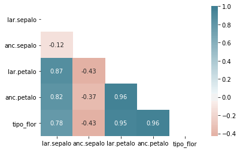

# Estandarización, covarianza y correlación


```python
import numpy as np
import pandas as pd
import scipy.stats

import seaborn as sns
import matplotlib.pyplot as plt

%matplotlib inline
```


```python
df = pd.read_csv('iris-data.csv', index_col=0)
```


```python
df.columns
```


    Index(['lar.sepalo', 'anc.sepalo', 'lar.petalo', 'anc.petalo', 'tipo_flor'], dtype='object')


```python
df.tipo_flor.value_counts()
```


    2.0    50
    1.0    50
    0.0    50
    Name: tipo_flor, dtype: int64


```python
y = df['lar.petalo']
fig, axis = plt.subplots()
axis.set_title('Variable original')
axis.hist(y, bins=30)
axis.axvline(x = np.mean(y), c='k', label='Media', linestyle='--')
axis.axvline(x = np.mean(y) + np.std(y), c='r', label='Desv. Est.', linestyle='--')
axis.legend()
```


    <matplotlib.legend.Legend at 0x7f62825a67d0>


```python
# Primero centramos la variable, para ello, se debe restar el valor de la media a cada uno de los valores de Y.
y = df['lar.petalo']
fig, axis = plt.subplots()
axis.set_title('Variable Centrada')
axis.hist(y- np.mean(y), bins=30)
axis.axvline(x = np.mean(y - np.mean(y)), c='k', label='Media', linestyle='--')
axis.axvline(x = np.mean(y) + np.std(y), c='r', label='Desv. Est.', linestyle='--')
axis.legend()
```


    <matplotlib.legend.Legend at 0x7f628041e810>


```python
# Reducción de la variable
y = df['lar.petalo']
fig, axis = plt.subplots()
axis.set_title('Variable Estandarizada')
axis.hist((y - np.mean(y))/np.std(y), bins=30)
axis.axvline(x = np.mean((np.mean(y - np.mean(y))/np.std(y))), c='k', label='Media', linestyle='--')
axis.axvline(x = np.mean((np.mean(y - np.mean(y))/np.std(y))) + np.std((y - np.mean(y))/np.std(y)), c='r', label='Desv. Est.', linestyle='--')
axis.legend()
```


    <matplotlib.legend.Legend at 0x7f628036ed10>


```python
fig, axis = plt.subplots()
axis.scatter(df['lar.petalo'], df['lar.sepalo'], alpha=0.7)
axis.set_xlabel('Largo Petalo')
axis.set_ylabel('Largo Sepalo')
axis.autoscale()
```


```python
np.cov(df['lar.petalo'], df['lar.sepalo'])
# El resultado es una matriz de 2x2. Es una matriz de covarianza.
# La Relación son las variables en las posiciones (0,1)(1,0) 
# Las variables en las posiciones (0,0)(1,1) son las varianza de cada una de las variables individuales.
# Lo que podemos leer de esto, es que son variables de relación positiva de magnitud 1.2.
```


    array([[3.11627785, 1.27431544],
           [1.27431544, 0.68569351]])


```python
# Correlación de la magnitud de la fuerza
df.corr(method = 'spearman')
# La correlación entre largo sepalo y el largo del petalo es fuerte, ya que se apróxima bastante a 1.
```


<div>
<style scoped>
    .dataframe tbody tr th:only-of-type {
        vertical-align: middle;
    }

    .dataframe tbody tr th {
        vertical-align: top;
    }

    .dataframe thead th {
        text-align: right;
    }
</style>
<table border="1" class="dataframe">
  <thead>
    <tr style="text-align: right;">
      <th></th>
      <th>lar.sepalo</th>
      <th>anc.sepalo</th>
      <th>lar.petalo</th>
      <th>anc.petalo</th>
      <th>tipo_flor</th>
    </tr>
  </thead>
  <tbody>
    <tr>
      <th>lar.sepalo</th>
      <td>1.000000</td>
      <td>-0.166778</td>
      <td>0.881898</td>
      <td>0.834289</td>
      <td>0.798078</td>
    </tr>
    <tr>
      <th>anc.sepalo</th>
      <td>-0.166778</td>
      <td>1.000000</td>
      <td>-0.309635</td>
      <td>-0.289032</td>
      <td>-0.440290</td>
    </tr>
    <tr>
      <th>lar.petalo</th>
      <td>0.881898</td>
      <td>-0.309635</td>
      <td>1.000000</td>
      <td>0.937667</td>
      <td>0.935431</td>
    </tr>
    <tr>
      <th>anc.petalo</th>
      <td>0.834289</td>
      <td>-0.289032</td>
      <td>0.937667</td>
      <td>1.000000</td>
      <td>0.938179</td>
    </tr>
    <tr>
      <th>tipo_flor</th>
      <td>0.798078</td>
      <td>-0.440290</td>
      <td>0.935431</td>
      <td>0.938179</td>
      <td>1.000000</td>
    </tr>
  </tbody>
</table>
</div>


```python
corr = df.corr(method = 'spearman')
```


```python
sns.heatmap(corr, xticklabels=corr.columns, yticklabels = corr.columns)
```


    <matplotlib.axes._subplots.AxesSubplot at 0x7f62b2c45b50>


```python
# Haciendo más entendible el gráfico.
plt.subplots()
mask = np.zeros_like(df.corr(), dtype = np.bool)
mask[np.triu_indices_from(mask)] = True

sns.heatmap(df.corr(), cmap = sns.diverging_palette(20, 220, n = 200), mask = mask, annot = True, center = 0)
```


    <matplotlib.axes._subplots.AxesSubplot at 0x7f6280206390>





```python
# Dejando la diagonal principal, a modo de delimitador
corrK = df.corr(method='kendall')
mask = np.zeros_like(corrK, dtype = np.bool)
mask[np.triu_indices(len(corrK), 1)] = True
sns.heatmap(df.corr(), cmap = sns.diverging_palette(20, 220, n = 200), mask = mask, annot = True, center = 0)
```


    <matplotlib.axes._subplots.AxesSubplot at 0x7f6280091850>


```python
# Ordenando por el tipo de flor
plt.figure(figsize=(5,5))
sns.heatmap(df.corr()[['tipo_flor']].sort_values(by=['tipo_flor'], ascending=False).head(50), vmin=-1, annot=True)
```


    <matplotlib.axes._subplots.AxesSubplot at 0x7f62800257d0>


