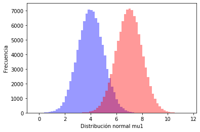
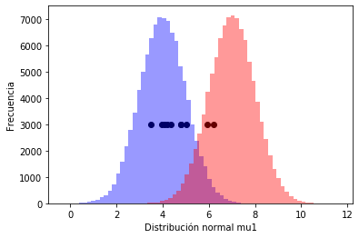

```python
import sklearn
import numpy as np
import pandas as pd
import matplotlib.pyplot as plt
from sklearn.datasets import load_iris
from scipy import stats
import seaborn as sns

%matplotlib inline
```


```python
from scipy.stats import norm

x1 = 3
mu1 = 4
mu2 = 7
sigma = 1
# pdf = Probability Density Function
p_muestra = norm.pdf(x1, mu2, sigma)

p_muestra
```


    0.00013383022576488537


```python
from scipy.stats import norm

x1 = 3
x2 = 10

mu1 = 4
mu2 = 7
sigma = 1
# pdf = Probability Density Function
p_muestra = norm.pdf(x1, mu1, sigma) * norm.pdf(x2, mu1, sigma)

p_muestra
```


    1.4701857752651781e-09


```python
muestra_10 = norm.rvs(5, sigma, size= 10)
muestra_10
```


    array([5.03999132, 4.35107672, 3.49101093, 4.78435101, 5.94485393,
           3.96230754, 6.20634036, 4.21125146, 4.05992582, 4.78345137])


```python
data1 = norm.rvs(mu1, sigma, size= 100000)
data2 = norm.rvs(mu2, sigma, size= 100000)
```


```python
ax = sns.distplot(data1, bins = 50, color = 'blue', kde = False)
ax.set(xlabel = 'Distribución normal mu1', ylabel = 'Frecuencia')

ax = sns.distplot(data2, bins = 50, color = 'red', kde = False)
ax.set(xlabel = 'Distribución normal mu1', ylabel = 'Frecuencia')
```


    [Text(0, 0.5, 'Frecuencia'), Text(0.5, 0, 'Distribución normal mu1')]





```python
muestra_10
y = list([])

for i in range(10):
    y.append(3000)
```


```python
ax = sns.distplot(data1, bins = 50, color = 'blue', kde = False)
ax.set(xlabel = 'Distribución normal mu1', ylabel = 'Frecuencia')

ax = sns.distplot(data2, bins = 50, color = 'red', kde = False)
ax.set(xlabel = 'Distribución normal mu1', ylabel = 'Frecuencia')

ax.scatter(muestra_10, y, c = 'k')
```


    <matplotlib.collections.PathCollection at 0x7f268576ad90>





Bajo una muestra podemos tener la probabilidad de ocurrencia basado en mu1 o mu2, con una diferencia grande.
Podemos ver cómo la muestra puede pertenecer con mayor o menor probabilidad a alguna de las 2 hipotesis sobre el parámetro poblacional mu1.
