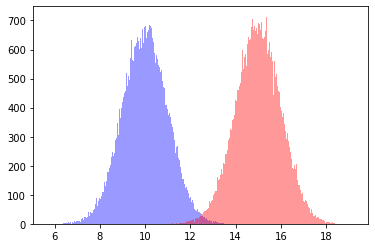
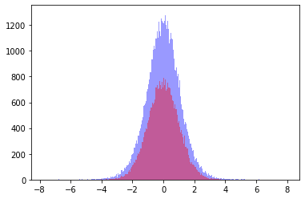
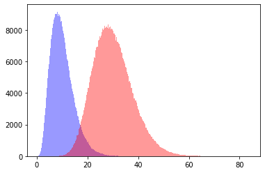
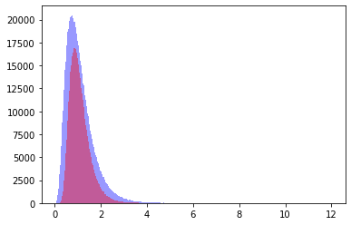

# Distribuciones Muestrales


```python
import matplotlib.pyplot as plt
from IPython.core.display import Image
import seaborn as sns

%matplotlib inline
```

# norm Normal 


```python
from scipy.stats import norm

data1 = norm.rvs(15, size = 100000)
data2 = norm.rvs(10, size = 100000)

ax = sns.distplot(data2, bins = 500, kde = False, color = 'blue')
ax = sns.distplot(data1, bins = 500, kde = False, color = 'red')
```





# t student


```python
from scipy.stats import t

data1 = t.rvs(100, size = 100000)
data2 = t.rvs(10, size = 100000)

ax = sns.distplot(data2, bins = 500, kde = False, color = 'blue')
ax = sns.distplot(data1, bins = 500, kde = False, color = 'red')
```





# Chi cuadrada


```python
from scipy.stats import chi2

data1 = chi2.rvs(30, size = 1000000)
data2 = chi2.rvs(10, size = 1000000)

ax = sns.distplot(data2, bins = 500, kde = False, color = 'blue')
ax = sns.distplot(data1, bins = 500, kde = False, color = 'red')
```





# f Fisher


```python
from scipy.stats import f

data1 = f.rvs(30, 25, size = 1000000)
data2 = f.rvs(10, 25, size = 1000000)

ax = sns.distplot(data2, bins = 500, kde = False, color = 'blue')
ax = sns.distplot(data1, bins = 500, kde = False, color = 'red')
```





```python
f.pdf(4, 15, 25)
```


    0.0019800859524222187


```python
f.cdf(4, 15, 25)
```


    0.9988900520089906


```python
f.ppf(0.9988900520089906, 15, 25)
```


    4.000000000000022


