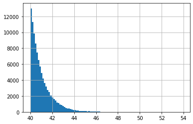
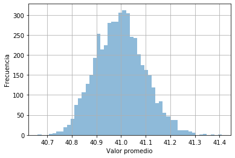

# Teorema del límite central


```python
import pandas as pd
import numpy as np
from scipy.stats import expon
from scipy.stats import uniform

import matplotlib.pyplot as plt
%matplotlib inline
```


```python
poblacion = pd.DataFrame()
poblacion['numbers'] = expon.rvs(40, size = 100000)
```


```python
poblacion['numbers'].hist(bins = 100)
```


    <matplotlib.axes._subplots.AxesSubplot at 0x7f87a278c910>





```python
muestra_promedio = []
tamano = 5000
for i in range(tamano):
    muestra_promedio.append(poblacion.sample(n=100).mean().values[0])
```


```python
muestra_promedio
```


    [41.064878363820654,
     41.020875931651446,
     40.829157529782464,
     41.119581684748745,
     40.941653488157556,
     40.90781423368995,
     41.18683322883889,
     41.05697753253793,
     40.94922003567635,
     41.08665196452449,
     41.017858775919564,
     40.928583585956915,
     41.03121341511756,
     41.067397815998866,
     40.889169807511514,
     40.960409559458405,
     41.03045030493746,
     41.058638542564395,
     41.078271327814626,
     40.99163661587702,
     41.23996956227762,
     41.10434566628369,
     41.091345524116214,
     41.19791278956415,
     40.991204537944775,
     41.04508484507447,
     41.01437252657036,
     41.015305630280466,
     40.98462478323728,
     40.78138528377478,
     41.10125263312106,
     40.77836248011829,
     41.14635866595248,
     40.99919317393378,
     40.93988807704192,
     40.95914851543522,
     40.933834764623384,
     40.90198396815742,
     41.021542553680895,
     41.00710374443657,
     40.9835968128953,
     40.867902516872405,
     40.87905802447687,
     41.09341834830924,
     41.08164495442552,
     41.045188085922256,
     41.03894766899911,
     40.91293418343748,
     41.0669922380777,
     40.82596541085525,
     40.853153424530745,
     40.968859341386604,
     41.00074066085185,
     40.77375054273491,
     40.93991820136751,
     40.855996648361646,
     41.14979340551009,
     41.19421917484589,
     40.99375474596319,
     40.989448393565844,
     40.987822872765385,
     40.93628789792424,
     40.99776586163067,
     41.12174781719043,
     41.1062440910293,
     40.88460878155214,
     41.031489659913625,
     40.94528961988531,
     41.22296453197409,
     40.99679709977721,
     40.843067229715004,
     41.0462330143506,
     40.78947098097603,
     40.82548247720109,
     40.98652465967745,
     41.17992938733428,
     40.89409582491075,
     41.03835758977513,
     40.88592447320277,
     41.01761899966718,
     40.86896346737489,
     41.00081569790475,
     40.95509833346883,
     40.90229060524892,
     40.995573680143316,
     41.13311053111251,
     41.06140004298149,
     40.878281502158146,
     41.083663343734905,
     40.969550210239156,
     40.82627450996414,
     40.958842279335606,
     40.94670956003662,
     41.01627617622316,
     41.24749572322314,
     41.0811178237992,
     40.923382638022616,
     41.002570939720606,
     41.06319211628489,
     40.97013336023203,
     40.938221722918435,
     40.94176211475405,
     40.990046241540384,
     41.02656182413985,
     40.93823486737178,
     40.921717382803074,
     41.015406767818305,
     40.99462486696505,
     41.093055392087145,
     41.03004484342917,
     40.99245155599193,
     40.96029227535475,
     41.04681517193032,
     40.82722417644701,
     41.02158515423916,
     40.81735183025849,
     41.098457978951785,
     41.18061434264614,
     40.91267707179872,
     40.93023086466889,
     40.88122405688562,
     40.93057700961471,
     40.80213771771713,
     40.86505737237373,
     41.21812643044711,
     40.95269990751901,
     41.043033744521054,
     40.90154187650266,
     40.95037640619227,
     40.938256158600126,
     40.953336393700845,
     40.912661799117416,
     41.04062510957414,
     40.782999846142296,
     40.92911860212785,
     40.86922370848787,
     40.971915747531185,
     41.04380461079986,
     40.9739426282796,
     41.097348677727766,
     41.1929987327275,
     40.804109300065925,
     40.879260166740835,
     40.89777600074158,
     40.87166613957438,
     40.98042286012813,
     40.915865540819915,
     40.96251486675094,
     40.93522980170898,
     41.048619814306775,
     40.95040970811198,
     41.00125481601358,
     41.12696180116737,
     40.995145068004824,
     41.03401013657614,
     41.082171200806414,
     40.98468160863381,
     40.87736034068303,
     41.12609857937289,
     40.85155076576618,
     41.03704634252049,
     40.90454763532338,
     41.09776494433257,
     40.91704545582606,
     41.005313878034364,
     41.05459208194105,
     40.757435509815835,
     40.951778147664,
     40.93655157487731,
     40.92538135821627,
     41.272902529503405,
     40.86714677213292,
     40.873202807893456,
     40.95884546564943,
     40.828286189062226,
     41.01189248078117,
     40.93291843062454,
     41.02208379969591,
     40.827087509684304,
     41.01014804840761,
     41.07437547317408,
     41.056843283069746,
     41.028832885692374,
     40.87334077510582,
     40.96062045604644,
     41.0394155968887,
     40.942433906557255,
     40.883743558567076,
     41.02386207009245,
     40.93454270565891,
     40.87768205316438,
     41.07171612247508,
     40.98167037634998,
     41.214606319644325,
     41.01890104837908,
     41.15482459924978,
     41.00414803579821,
     41.0621224212876,
     41.03485314114073,
     40.90884701344736,
     40.96384316137909,
     40.83084695929624,
     40.912518900396314,
     41.023217638085974,
     40.864190612135765,
     40.886164841996866,
     40.97627404601619,
     40.97269652752899,
     41.06270324926679,
     41.0325271167753,
     40.91339713940995,
     40.74103376996927,
     40.98848983475145,
     41.02698295553917,
     41.13784246347294,
     41.07011839720573,
     41.05304296276382,
     40.92939812069121,
     40.851973618490696,
     40.80753003805788,
     41.15743151145324,
     41.164717509188385,
     41.15999474584547,
     40.8035358956481,
     41.145364156161264,
     41.06265286599946,
     41.10327013467879,
     41.124290435617795,
     40.98663650846388,
     40.86608756373503,
     40.85610873135437,
     40.9778384416706,
     40.88081209577688,
     41.0496494544066,
     40.954472343805506,
     40.94699541490497,
     40.88834294062779,
     40.99905370534702,
     41.08357275399998,
     41.07534476877257,
     40.98717180084129,
     40.850292819285436,
     41.10283634666404,
     41.019774851939246,
     40.878943631877526,
     41.18228645717272,
     41.12506762673103,
     41.06436584179022,
     41.030894794061886,
     41.02741189452152,
     40.98268070163629,
     40.90724711373273,
     41.070194733095114,
     40.9532188873907,
     41.07312163393716,
     40.90062101253614,
     41.078118559589775,
     40.84992265618891,
     40.972336561489044,
     40.91915685213772,
     40.88462079404437,
     40.93723792210325,
     40.99503762626196,
     40.943081973378455,
     40.88754133956486,
     41.081708147271854,
     41.089751006510305,
     40.989996105244366,
     40.80379775582953,
     41.22701598048763,
     41.21301561293061,
     40.90757184940619,
     41.03029418462834,
     41.02922252620221,
     41.08324917549201,
     41.195829683347505,
     40.97822157418254,
     41.20013308615765,
     41.10299967412005,
     41.01333874975937,
     41.101790639012485,
     40.82959169094841,
     40.901604695081076,
     41.03781574800538,
     41.02183127606084,
     41.01202234465722,
     40.899480610300195,
     41.01208525864904,
     40.98434949525202,
     40.99365297188848,
     41.08420126980864,
     41.00487315374984,
     40.87819880385459,
     40.977518793964464,
     40.85577210257243,
     40.995948712842555,
     41.04313446883465,
     40.97622344221763,
     41.14746692662482,
     41.09763260345092,
     40.98182222860893,
     41.060375687881596,
     41.129479320471575,
     40.97684473530526,
     41.14626845013098,
     41.07426965741176,
     41.122442449240964,
     40.98689071216174,
     40.94881709300966,
     41.00474424567792,
     40.97078828428097,
     40.978643711262656,
     41.03900541814038,
     40.852962583202846,
     40.90876243386498,
     41.114740096190154,
     40.870622041682175,
     41.21941788048415,
     40.92700707523518,
     41.160532901705544,
     41.06021706372118,
     41.02151292525045,
     40.917647194644054,
     40.8892409324642,
     40.846681682840305,
     41.09830507207684,
     40.95147573639852,
     41.01200126079747,
     40.9788566250623,
     40.924331585440875,
     41.12679336408155,
     40.86470323322263,
     41.07167563899903,
     40.91082871107792,
     40.91479920805161,
     40.948255596852185,
     41.09208208438057,
     41.05358523206003,
     41.018601858900865,
     41.06738399136739,
     41.003938985577534,
     40.95272574163244,
     41.00915911145892,
     40.97777609947775,
     40.99142401446213,
     41.016806233119745,
     40.984835557808864,
     41.116656171264715,
     40.90841057594017,
     40.77524803684392,
     40.75168223064279,
     40.810210904408166,
     41.0196335568904,
     40.819946783033494,
     40.8916188490213,
     40.84830185779849,
     41.011792121540914,
     41.09551343718051,
     40.98091192743036,
     40.903407527722166,
     40.9697700417289,
     41.25258672105352,
     40.847990326294045,
     41.02565356537418,
     40.96494144280385,
     41.024585054994866,
     41.00375381200444,
     40.96706771643419,
     41.09188847388833,
     40.9525279503873,
     41.17458034508439,
     40.963375904126245,
     41.16303956815805,
     41.032767944728455,
     41.12719314610775,
     40.93276678757586,
     41.07092784458554,
     41.03310262319002,
     41.10922114486538,
     41.157746064839145,
     40.90547763758651,
     40.91406020984605,
     40.98454445364155,
     41.18296001653266,
     40.947471425779476,
     41.01306150077549,
     40.98378212932498,
     40.9955191421436,
     41.036763992074974,
     40.867016271776954,
     40.85898864624951,
     41.03764738766479,
     40.92976163598377,
     40.981403462393146,
     41.15825390651555,
     40.96870798265023,
     40.87783545144002,
     40.81285635555975,
     41.10513229053965,
     41.08692521800533,
     40.86946815535844,
     41.018204731553624,
     40.906107151425886,
     40.93702181389542,
     40.97833890517219,
     41.02632475375571,
     40.913529605347144,
     41.15044065537767,
     40.93437214326311,
     41.06368060467325,
     41.04376758256831,
     40.97469472540496,
     41.045987184663524,
     41.18403772835084,
     41.030396924805416,
     40.991457344861054,
     41.107819697690275,
     41.1902685346257,
     41.0940643706093,
     40.83955996383788,
     40.96777883654424,
     41.00041715832802,
     40.93692245910498,
     41.10547611878685,
     41.01920502214947,
     40.94015367484016,
     41.26350645713839,
     40.94724806376275,
     40.88720294828631,
     41.08943356519192,
     41.14761836755407,
     40.980177125287675,
     40.9747250713379,
     40.9549523281572,
     40.88102687957786,
     40.88779035803311,
     41.011328608702335,
     41.03410341431065,
     41.015080140769214,
     40.84203306426148,
     41.0434582517205,
     40.84623410777771,
     40.948382724538924,
     41.01855510424652,
     41.00041107184314,
     41.08336023341923,
     40.88954621792182,
     40.84307198386068,
     40.90157345557996,
     41.27944515173564,
     40.90582981786748,
     41.022455833052966,
     41.036241010370894,
     41.01844234812939,
     40.89454556822705,
     40.96959265402318,
     41.02486663321892,
     41.041942587593795,
     41.143255639233736,
     40.89625579262252,
     40.90892445962499,
     41.05858682895422,
     40.95739684260977,
     41.049533112156695,
     40.99879281996394,
     41.16419219226473,
     40.85993730035767,
     41.07322517033993,
     40.96498402316837,
     40.858261628387,
     40.98591274633483,
     40.932113417315094,
     40.97285643076901,
     40.92617770726098,
     41.09784431115495,
     41.00209272147022,
     41.02207216613737,
     41.1059953986801,
     41.007345536142104,
     41.15093101033048,
     40.91086192258743,
     40.970966114053816,
     40.90857986752151,
     40.98335388562923,
     40.878578881430755,
     41.17759685210607,
     40.94942721026934,
     41.014385695815434,
     41.07137622483966,
     41.07157595364316,
     41.00389071861039,
     41.00527893203321,
     41.2018238678767,
     41.08288904453664,
     40.88398662235406,
     41.102568186848956,
     41.00093724045911,
     40.9477203945292,
     40.9401936256214,
     41.02653425240932,
     41.161440114235695,
     40.9711518297131,
     40.95934170239282,
     41.04218083939677,
     40.8269875219591,
     41.190581671253995,
     40.889467344993726,
     41.109066278243624,
     40.93892083655956,
     41.10990600273271,
     40.95115101230971,
     41.161859791335225,
     40.976184868462695,
     41.05989465951384,
     40.93496740785026,
     41.02034371897509,
     41.028025630090106,
     40.97379251768091,
     41.082044155937325,
     41.203261448997225,
     41.00489853626878,
     41.054170232114146,
     41.06524189691973,
     40.85653369880345,
     41.013833153165386,
     41.203675799315576,
     40.900104910080735,
     41.07957841213669,
     41.03421971496934,
     40.99621839417582,
     40.98039199218488,
     40.856649925509316,
     41.038211319933616,
     40.914797139323454,
     40.9399167203898,
     40.920952798995025,
     41.03161214337179,
     40.97051921963299,
     40.99148631276157,
     40.861318651793944,
     40.93728577997863,
     41.19275913145828,
     40.98686513618071,
     40.9711551472112,
     40.996446527781885,
     40.90089693418605,
     40.94686304556002,
     41.042308194593396,
     40.97567133673503,
     41.04986198998692,
     40.81655967145555,
     41.037825051526006,
     41.09072227549914,
     40.871977493145266,
     41.032120236049856,
     41.068125449816165,
     41.141173244465314,
     41.04359414606817,
     41.02192004575958,
     40.93618365396004,
     41.122159764107124,
     41.07617939061362,
     41.084614087234485,
     40.962976914060455,
     40.950826232004545,
     40.90545695759435,
     41.17529975812311,
     40.98778236451951,
     41.14849238975542,
     41.01069847622823,
     41.16309487536144,
     40.9642990079574,
     41.02353564933658,
     41.06413796204391,
     41.16674402308678,
     41.03412421776692,
     40.934522562497,
     41.02999951629861,
     40.972527734168025,
     41.19942101899287,
     41.24628897705968,
     41.11877837490286,
     40.99932731280947,
     41.21299441116712,
     40.92361190297411,
     40.95145829233211,
     40.99677617002067,
     41.107243339703835,
     40.86371240536581,
     40.88343795203088,
     40.970371634846764,
     40.98312869564262,
     41.014933890718495,
     41.0008578901735,
     41.03248697008221,
     41.05403170126927,
     41.05396263356066,
     41.033055309783386,
     40.95967226146611,
     41.00306081823851,
     40.91549099814721,
     40.877746060299934,
     41.22052753193185,
     40.84025792459067,
     40.85001409039758,
     41.04827784896466,
     40.95383989295331,
     41.005468646943534,
     41.157871400898294,
     41.00351565010849,
     40.999652267011044,
     40.90831130362789,
     41.13667291804704,
     41.086299766039986,
     40.99919447526713,
     41.12023911200444,
     41.04157007754287,
     41.08934498519845,
     40.97553427071307,
     41.01190819605562,
     41.14380835990291,
     40.97258894083191,
     40.87451485413359,
     40.94873145631716,
     40.94592601420398,
     40.91693346407564,
     41.108111828940174,
     41.0378380307522,
     40.88827862660471,
     40.91017703983594,
     41.04195807541221,
     41.01924617536815,
     41.0825482384229,
     41.09815152344016,
     40.9833456131889,
     40.973903096627076,
     41.209991517549106,
     41.135770888731024,
     40.97642148649156,
     40.914286096408695,
     40.99384274408722,
     40.93376644043267,
     41.04711143885482,
     41.02739545010348,
     40.931296568210634,
     40.94806628275759,
     41.05108020067619,
     40.99194850954859,
     40.994686589657924,
     40.91292130689561,
     41.060994235538956,
     40.93166652257319,
     40.80611674970965,
     41.04051279787879,
     40.95123528062701,
     41.05715842628305,
     41.14765202902474,
     40.99291262161854,
     40.9415022956449,
     41.01836799164051,
     40.979617195830485,
     41.2414529418322,
     40.912341628797186,
     40.952774808728954,
     41.031545504812165,
     40.81585557395945,
     41.02051891241916,
     40.85956782697723,
     40.980291968351246,
     41.14325647862106,
     40.89729385023472,
     40.98324973353068,
     41.03643069008344,
     41.03103690584817,
     41.076224688317296,
     40.99448845054315,
     41.07716458765212,
     40.94983974837949,
     40.820506227737404,
     41.02501565410862,
     40.94341564777271,
     40.903894991782174,
     41.15464792048267,
     41.0337877199178,
     40.85596438148627,
     40.87092406885585,
     41.05953915973816,
     40.865473899143716,
     41.03303947194673,
     40.8737715163608,
     40.93607324000666,
     41.05727776047035,
     40.817758491933226,
     40.940573281247474,
     40.948640612642336,
     40.887412732505844,
     40.88506119217399,
     41.029863956691415,
     41.099024669832126,
     40.90241129390134,
     41.040449452714356,
     41.01635309851662,
     40.90134320845607,
     41.09756162467963,
     41.12549129438572,
     40.995787153300554,
     41.037127887968666,
     40.98341018130266,
     40.88356868653308,
     40.92900513880879,
     41.0685744303577,
     40.99429379829146,
     41.26065342640686,
     41.11663129977716,
     40.93105387641111,
     41.017905752491444,
     41.06611232471066,
     40.888125100894605,
     40.8259886892778,
     41.0411505417126,
     41.03289800485147,
     40.797199909260186,
     40.98007100319207,
     41.16569158243878,
     40.955625694252575,
     40.95258240674893,
     41.01369616878624,
     41.01049891528283,
     41.08351033381201,
     41.01257041874312,
     40.9324717498983,
     41.16515971650848,
     41.1462808520803,
     40.97981149905098,
     41.070885458599854,
     40.830721685850385,
     41.18804039308513,
     41.04729645153886,
     41.012105364972015,
     40.79272968717931,
     41.34011569822237,
     40.8277453384701,
     41.08527343702718,
     40.96169663947389,
     41.07972996119978,
     40.96121399194196,
     40.96061794339363,
     41.010050459691996,
     41.065909674417846,
     41.075535915409006,
     40.87480482776048,
     41.065089318835795,
     40.980247984175676,
     41.00020354003413,
     40.95624649291035,
     41.037317417850325,
     41.00527417965564,
     41.22382094292673,
     40.87391088361472,
     40.94621993923169,
     40.90156245116938,
     41.023073363157806,
     40.99570080359178,
     41.10967368795328,
     41.053319123251434,
     41.02776265015842,
     41.04756318697553,
     41.00122847011974,
     41.153903658930545,
     40.839329470261816,
     40.904127244969025,
     40.95638838013719,
     40.91531533829104,
     40.97738839457193,
     40.86797701578402,
     40.89481017299497,
     41.03563351015749,
     40.98159566793357,
     41.142821143645534,
     41.13508547406482,
     41.070204398091526,
     41.07902280799305,
     40.90487269841653,
     40.92982998005097,
     41.11808284253188,
     40.947712411372926,
     41.3003358258269,
     40.94356047790218,
     40.86920631237921,
     41.087993072157445,
     40.97573311976868,
     41.03975952576054,
     41.03780814861144,
     40.93949914187037,
     40.88495019620456,
     41.0080057594783,
     41.04430330340372,
     41.073345373820565,
     41.10028543187985,
     40.94465671922346,
     41.07803946849626,
     40.87023322244856,
     41.08454990473543,
     40.78773844195353,
     41.077765299044984,
     40.92500167949215,
     41.053127029257794,
     41.00902496060926,
     41.07439258181956,
     41.1091548937731,
     41.06037581978614,
     40.92647215998355,
     41.05595785715715,
     41.08000327165162,
     41.15680932809618,
     41.00609707881931,
     40.99784563019127,
     40.98805628312863,
     41.03321038576031,
     40.95270940148697,
     40.923521351482115,
     40.78248544778742,
     40.944631445516094,
     40.97176099356375,
     40.94537464917872,
     40.947400738515114,
     40.97480036830708,
     41.0022587372915,
     40.92402126212684,
     40.94798907308499,
     40.97756301382423,
     40.98245359313242,
     40.99425258853261,
     41.07042391090057,
     41.0426694592387,
     41.01386448231731,
     41.02829851745607,
     40.91490143422242,
     41.180105039794924,
     41.02371300899461,
     40.97474978336336,
     41.033868465355944,
     40.943862816912954,
     41.02188014611465,
     40.816744362549166,
     40.91784882158256,
     41.081381403980885,
     40.92592163468438,
     40.969257553886735,
     40.95377709883567,
     41.022125011073484,
     41.03868791279206,
     40.88887397901113,
     40.844273922777305,
     40.92185483643264,
     41.19476956627851,
     40.859994491559924,
     41.04073703463499,
     41.27585975501036,
     40.95769634117181,
     40.96776265541846,
     40.90694455954482,
     40.95269761094196,
     41.07915741991197,
     41.10037659166576,
     40.940897842936515,
     40.94992847120349,
     41.16855436271115,
     41.095859415694314,
     40.76614322673552,
     40.9987652735452,
     40.84569928656455,
     40.9649402703377,
     41.103780159734946,
     41.03153878006271,
     40.954934799996806,
     41.1883683173247,
     40.91862478846299,
     41.030808714386175,
     40.91199266534172,
     41.1300178303704,
     40.99852405603376,
     41.27977919218062,
     41.07399564984813,
     41.11089750495721,
     41.010484820316705,
     41.09229037713067,
     40.95811072836001,
     41.07578722497955,
     40.997842832195886,
     41.061565127783666,
     41.06787995914342,
     41.064333995587646,
     41.00929627594424,
     40.900387464565945,
     41.004083059676105,
     40.97446961460111,
     40.97862179922179,
     40.958726893329704,
     41.124191282450305,
     41.02560221118353,
     41.008474682325684,
     40.8885439763872,
     41.189214154185564,
     41.126998071148,
     41.016458026482304,
     41.03104583473941,
     41.03364990884199,
     40.85607797984837,
     40.98177615552513,
     40.84054729475709,
     40.95656801220484,
     40.966642845440994,
     41.2617309129276,
     40.89663696419095,
     40.977794910703544,
     40.95693582743579,
     40.972918365192456,
     40.860605262010715,
     40.9694511361982,
     41.0548251207771,
     41.07653289859952,
     41.09076159945842,
     40.942941346651025,
     41.14121487758701,
     40.9555817433884,
     40.95782315091276,
     40.993229479212076,
     41.00886572285342,
     41.04861174097479,
     41.01269939618905,
     40.97178081572984,
     40.99781501703336,
     40.92380317360927,
     41.09624394895552,
     40.956835442889634,
     41.12057010986258,
     41.08686487130609,
     40.969441425917076,
     40.813538744356904,
     40.91265352197874,
     41.01596050312717,
     40.95932645378369,
     41.07955996343054,
     40.934896273869114,
     40.92834623247842,
     40.96441331517156,
     41.053052324762994,
     41.044987848897634,
     40.915180428004874,
     40.9251801430793,
     40.9580282536655,
     41.158797555672145,
     40.81584830240331,
     41.00448684554079,
     41.043640885278045,
     41.02769717801216,
     41.12187852923766,
     40.89964571571502,
     40.84553901285554,
     41.01412485402354,
     41.16705719028622,
     40.97186404028964,
     40.90650837378287,
     40.954128561894656,
     41.013955039785806,
     41.11302626407924,
     41.102198830440926,
     41.02928652693138,
     40.927915830919794,
     40.98159889761054,
     41.08074034705386,
     41.04218436642023,
     41.15298527127162,
     40.818559883245484,
     40.90766543972083,
     40.91928450292075,
     40.874311789653945,
     41.00025344123069,
     40.92586436820484,
     40.91423409694665,
     41.05370069860097,
     40.76306000414064,
     41.081457655611246,
     40.892586976541025,
     41.02115704242449,
     40.93985037274035,
     40.984699636145166,
     41.116934208081446,
     40.94897602723858,
     41.005186646284976,
     40.961501804292666,
     40.9064598485844,
     40.96209798352357,
     41.22761434499457,
     40.97767334530951,
     41.01197227144796,
     41.0785834414346,
     41.04642604464308,
     41.04542199531892,
     ...]


```python
fig, ax = plt.subplots()
ax.hist(muestra_promedio, bins = 50, alpha = 0.5)
ax.set_xlabel('Valor promedio')
ax.set_ylabel('Frecuencia')
ax.grid()
```




