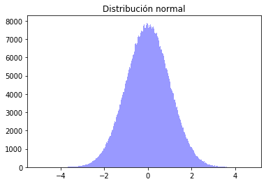
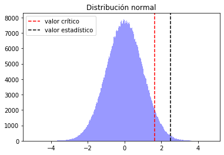

# Pruebas de hipótesis


```python
import pandas as pd
import numpy as np
from scipy.stats import expon
from scipy.stats import uniform

import matplotlib.pyplot as plt
import seaborn as sns

%matplotlib inline
```


```python
muestra = [42, 35, 29, 45, 41, 57, 54, 47, 48, 56, 47, 35, 52, 31, 52, 55, 57, 58, 26, 29, 32, 37, 32, 34, 48, 20, 48, 51, 27, 24, 39, 40, 31, 34, 23, 24, 41, 58, 44, 48, 31, 23, 27, 55, 43, 47, 30, 57, 38, 51]
```


```python
len(muestra)
```


    50


## Hipótesis


```python
media, var, skew, kurt = expon.stats(scale = 30, moments = 'mvsk')
```


```python
# Paso 1: Parámetro lambda
# Paso 2: HP
mu = 30
mu > 30

# Paso 3: Mejor estimador
# Estimador: Promedio
# Paso 4: Distribución: Normal
promedio = np.mean(muestra)
promedio
```


    40.66


```python
# Paso 5: Calculo del Estimador y su Valor Asociado estadístico
z = (promedio - mu) / np.sqrt(var/50)
z
```


    2.5125860958161983


```python
# Paso 6: Definir un criterio de rechazo y la tolerancia al error
alpha = 0.05

# Criterios de rechazo
from scipy.stats import norm
data_norm = norm.rvs(size = 1000000)
```


```python
ax = sns.distplot(data_norm, bins = 500, kde = False, color = 'blue')
ax.set_title('Distribución normal')
```


    Text(0.5, 1.0, 'Distribución normal')





```python
# El valor crítico será el punto en el que nuestra distribución acumule una probabilidad de cola derecha que esté asociada a nuestro valor de error alfa
valor_critico = norm.ppf(1-alpha, loc = 0, scale = 1)
valor_critico
```


    1.6448536269514722


```python
ax = sns.distplot(data_norm, bins = 500, kde = False, color = 'blue')
ax.set_title('Distribución normal')
ax.axvline(x = valor_critico, linestyle = '--', c = 'r', label = 'valor crítico')
ax.axvline(x = z, linestyle = '--', c = 'k', label = 'valor estadístico')
ax.legend()
```


    <matplotlib.legend.Legend at 0x7effc0275ed0>





El caso de valor crítico es Rojo, todo lo que esté por encima del valor crítico es poco probable bajo los valores del estimador, los valores poblacionales de mi variable aleatoria y bajo la muestra que he tomado, por lo tanto, con este criterio de rechazo, se puede decir que se tiene suficiente prueba estadística para concluir que mu no tiene un valor igual a 30, y en favor de la hipotesis alterna, mu probablemente sea mayor que 30.

## Conclusión del Ejemplo

El caso de Mustage Estaría a favor de que el tiempo que le toma a una persona logearse y poder acceder a un crédito es mayor a los requisitos que los requerimientos que necesitan sobre el proveedor.

