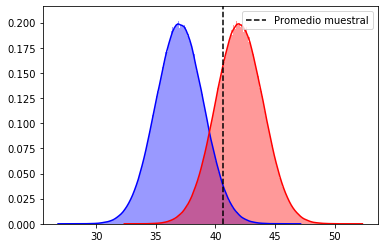

# Errores estadísticos Tipo 1 y Tipo 2


```python
import pandas as pd
import numpy as np


import seaborn as sns
import matplotlib.pyplot as plt
%matplotlib inline
```


```python
muestra = [42, 35, 29, 45, 41, 57, 54, 47, 48, 56, 47, 35, 52, 31, 52, 55, 57, 58, 26, 29, 32, 37, 32, 34, 48, 20, 48, 51, 27, 24, 39, 40, 31, 34, 23, 24, 41, 58, 44, 48, 31, 23, 27, 55, 43, 47, 30, 57, 38, 51]
```


```python
# 
mu1 = 37
mu2 = 42

promedio = np.mean(muestra)
promedio
```


    40.66


```python
desv = 2
z_1 = (promedio - mu1)/desv
z_2 = (promedio - mu2)/desv
```


```python
from scipy.stats import norm

data1 = norm.rvs(loc = mu1, scale = desv, size = 1000000)
data2 = norm.rvs(loc = mu2, scale = desv, size = 1000000)
```


```python
ax = sns.distplot(data1, bins = 500, kde = True, color = 'blue')
ax = sns.distplot(data2, bins = 500, kde = True, color = 'red')
ax.axvline(x=promedio, color = 'k', label = 'Promedio muestral', linestyle = '--')
ax.legend()
```


    <matplotlib.legend.Legend at 0x7fee693ea7d0>





```python
# Error tipo I: p rechazar H0 cuando esta es verdadera
p_prom_mu1 = norm.cdf(z_1)
1-p_prom_mu1
```


    0.03362496941962845


```python
# Error tipo II: p no rechazar H0 cuando esta es falsa
p_prom_mu2 = norm.cdf(z_2)
p_prom_mu2
```


    0.2514288950953095


