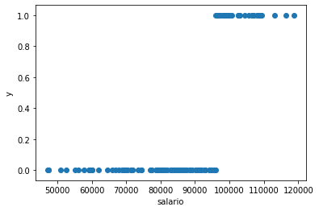

# Regresión Logística


```python
import pandas as pd
import numpy as np

import matplotlib.pyplot as plt
import seaborn as sns
%matplotlib inline

import statsmodels.api as sm
import pyreadstat as pr

from sklearn import linear_model
from sklearn.metrics import mean_squared_error, r2_score
from sklearn import metrics
from sklearn.metrics import accuracy_score
```


```python
file = 'compensacion-ejecutivos.sav'
df, meta = pr.read_sav(file)
df.columns
```


    Index(['salario', 'noasiat', 'gpa', 'postgrad', 'experien'], dtype='object')


```python
df.salario.describe()
```


    count       110.000000
    mean      85256.518182
    std       16419.359283
    min       47279.000000
    25%       74379.000000
    50%       86384.000000
    75%       96827.250000
    max      118683.000000
    Name: salario, dtype: float64


```python
# Vamos a convertir la variable Y en una variable binaria. Para ello se utiliza numpy.
# Queremos averiguar si el salario es > 96000, y si lo es, que tome el valor de 1, de lo contrario, que tome el valor de 0
y = np.where(df['salario'] > 96000, 1, 0)
X = df.drop(['salario'], axis = 1)
y
```


    array([1, 0, 0, 0, 0, 1, 0, 1, 0, 0, 0, 0, 0, 1, 0, 0, 0, 0, 1, 0, 1, 0,
           0, 0, 0, 0, 0, 0, 0, 1, 1, 1, 0, 1, 0, 0, 0, 1, 0, 0, 0, 0, 1, 0,
           0, 0, 1, 0, 0, 1, 1, 1, 0, 0, 1, 0, 0, 1, 0, 1, 0, 1, 0, 0, 0, 0,
           1, 0, 0, 0, 0, 0, 0, 1, 0, 1, 1, 0, 0, 1, 0, 1, 0, 1, 1, 0, 0, 0,
           0, 0, 1, 0, 0, 1, 0, 0, 0, 0, 0, 0, 0, 0, 0, 1, 0, 0, 0, 0, 0, 1])


```python
fig, ax = plt.subplots()
ax.scatter(df.salario, y)
ax.set_xlabel('salario')
ax.set_ylabel('y')
```


    Text(0, 0.5, 'y')





```python
reg_log = linear_model.LogisticRegression()
reg_log.fit(X, y)
```


    LogisticRegression(C=1.0, class_weight=None, dual=False, fit_intercept=True,
                       intercept_scaling=1, l1_ratio=None, max_iter=100,
                       multi_class='auto', n_jobs=None, penalty='l2',
                       random_state=None, solver='lbfgs', tol=0.0001, verbose=0,
                       warm_start=False)


```python
y_estimado = reg_log.predict_proba(X)
y_estimado
```


    array([[4.39538178e-01, 5.60461822e-01],
           [9.78148894e-01, 2.18511060e-02],
           [6.59286204e-01, 3.40713796e-01],
           [9.82159113e-01, 1.78408868e-02],
           [6.70848737e-01, 3.29151263e-01],
           [2.03018004e-01, 7.96981996e-01],
           [9.22478258e-01, 7.75217424e-02],
           [4.20159794e-01, 5.79840206e-01],
           [8.03662576e-01, 1.96337424e-01],
           [9.77631167e-01, 2.23688334e-02],
           [9.06109495e-01, 9.38905048e-02],
           [8.47522747e-01, 1.52477253e-01],
           [9.95393767e-01, 4.60623344e-03],
           [3.19263966e-01, 6.80736034e-01],
           [7.63327838e-01, 2.36672162e-01],
           [7.67016117e-01, 2.32983883e-01],
           [9.73512282e-01, 2.64877181e-02],
           [5.91913095e-01, 4.08086905e-01],
           [3.77281945e-01, 6.22718055e-01],
           [9.99180746e-01, 8.19254265e-04],
           [3.20250422e-01, 6.79749578e-01],
           [8.22737645e-01, 1.77262355e-01],
           [5.15421891e-01, 4.84578109e-01],
           [9.88088141e-01, 1.19118594e-02],
           [9.95048946e-01, 4.95105410e-03],
           [9.77747441e-01, 2.22525593e-02],
           [4.27308629e-01, 5.72691371e-01],
           [8.93642735e-01, 1.06357265e-01],
           [9.85167549e-01, 1.48324507e-02],
           [6.23936743e-01, 3.76063257e-01],
           [5.53154110e-01, 4.46845890e-01],
           [4.96462376e-01, 5.03537624e-01],
           [9.95231872e-01, 4.76812772e-03],
           [4.46983581e-01, 5.53016419e-01],
           [8.42983484e-01, 1.57016516e-01],
           [4.09634814e-01, 5.90365186e-01],
           [9.25147543e-01, 7.48524569e-02],
           [3.81069527e-01, 6.18930473e-01],
           [7.20178850e-01, 2.79821150e-01],
           [5.83721009e-01, 4.16278991e-01],
           [6.97575096e-01, 3.02424904e-01],
           [9.84831680e-01, 1.51683200e-02],
           [4.40875980e-01, 5.59124020e-01],
           [7.53803558e-01, 2.46196442e-01],
           [9.85587941e-01, 1.44120593e-02],
           [3.31923988e-01, 6.68076012e-01],
           [2.12337256e-01, 7.87662744e-01],
           [8.73948570e-01, 1.26051430e-01],
           [9.14263116e-01, 8.57368843e-02],
           [3.35794135e-01, 6.64205865e-01],
           [4.17778422e-02, 9.58222158e-01],
           [3.34523516e-02, 9.66547648e-01],
           [9.77819590e-01, 2.21804096e-02],
           [9.59065811e-01, 4.09341892e-02],
           [3.46239270e-01, 6.53760730e-01],
           [6.44288002e-01, 3.55711998e-01],
           [9.31213974e-01, 6.87860261e-02],
           [8.40220874e-02, 9.15977913e-01],
           [9.95015625e-01, 4.98437530e-03],
           [2.91036671e-01, 7.08963329e-01],
           [9.96145351e-01, 3.85464903e-03],
           [2.77123666e-01, 7.22876334e-01],
           [9.38590324e-01, 6.14096760e-02],
           [9.30370835e-01, 6.96291655e-02],
           [9.92405351e-01, 7.59464935e-03],
           [9.99194789e-01, 8.05211331e-04],
           [4.87206296e-01, 5.12793704e-01],
           [6.42507983e-01, 3.57492017e-01],
           [9.87817588e-01, 1.21824120e-02],
           [9.93215966e-01, 6.78403444e-03],
           [9.42592251e-01, 5.74077487e-02],
           [7.12471925e-01, 2.87528075e-01],
           [6.78995608e-01, 3.21004392e-01],
           [7.81326403e-02, 9.21867360e-01],
           [9.02248305e-01, 9.77516953e-02],
           [2.80848489e-01, 7.19151511e-01],
           [7.10012909e-01, 2.89987091e-01],
           [9.96211227e-01, 3.78877333e-03],
           [9.53833469e-01, 4.61665309e-02],
           [4.69386588e-01, 5.30613412e-01],
           [9.41036934e-01, 5.89630661e-02],
           [5.04004912e-01, 4.95995088e-01],
           [5.12455473e-01, 4.87544527e-01],
           [5.58270609e-01, 4.41729391e-01],
           [2.67476699e-01, 7.32523301e-01],
           [5.91110568e-01, 4.08889432e-01],
           [9.68774331e-01, 3.12256687e-02],
           [9.50782123e-01, 4.92178770e-02],
           [9.60654921e-01, 3.93450786e-02],
           [2.56775930e-01, 7.43224070e-01],
           [8.01640014e-01, 1.98359986e-01],
           [7.16698486e-01, 2.83301514e-01],
           [9.16020774e-01, 8.39792259e-02],
           [9.39462753e-02, 9.06053725e-01],
           [9.97330634e-01, 2.66936557e-03],
           [8.25739779e-01, 1.74260221e-01],
           [5.66293575e-01, 4.33706425e-01],
           [9.14938877e-01, 8.50611228e-02],
           [9.59533289e-01, 4.04667111e-02],
           [9.41879876e-01, 5.81201244e-02],
           [9.89424345e-01, 1.05756552e-02],
           [9.84670111e-01, 1.53298886e-02],
           [9.99185098e-01, 8.14902379e-04],
           [1.36517164e-01, 8.63482836e-01],
           [9.95569801e-01, 4.43019932e-03],
           [9.69293557e-01, 3.07064431e-02],
           [9.22614795e-01, 7.73852052e-02],
           [9.85559373e-01, 1.44406271e-02],
           [9.77701541e-01, 2.22984588e-02],
           [4.88538142e-01, 5.11461858e-01]])


```python
# Si queremos saber la probabilidad de ganar un salario superior a 96000
y_estimado_1 = reg_log.predict_proba(X)[:,1]
y_estimado_1
```


    array([5.60461822e-01, 2.18511060e-02, 3.40713796e-01, 1.78408868e-02,
           3.29151263e-01, 7.96981996e-01, 7.75217424e-02, 5.79840206e-01,
           1.96337424e-01, 2.23688334e-02, 9.38905048e-02, 1.52477253e-01,
           4.60623344e-03, 6.80736034e-01, 2.36672162e-01, 2.32983883e-01,
           2.64877181e-02, 4.08086905e-01, 6.22718055e-01, 8.19254265e-04,
           6.79749578e-01, 1.77262355e-01, 4.84578109e-01, 1.19118594e-02,
           4.95105410e-03, 2.22525593e-02, 5.72691371e-01, 1.06357265e-01,
           1.48324507e-02, 3.76063257e-01, 4.46845890e-01, 5.03537624e-01,
           4.76812772e-03, 5.53016419e-01, 1.57016516e-01, 5.90365186e-01,
           7.48524569e-02, 6.18930473e-01, 2.79821150e-01, 4.16278991e-01,
           3.02424904e-01, 1.51683200e-02, 5.59124020e-01, 2.46196442e-01,
           1.44120593e-02, 6.68076012e-01, 7.87662744e-01, 1.26051430e-01,
           8.57368843e-02, 6.64205865e-01, 9.58222158e-01, 9.66547648e-01,
           2.21804096e-02, 4.09341892e-02, 6.53760730e-01, 3.55711998e-01,
           6.87860261e-02, 9.15977913e-01, 4.98437530e-03, 7.08963329e-01,
           3.85464903e-03, 7.22876334e-01, 6.14096760e-02, 6.96291655e-02,
           7.59464935e-03, 8.05211331e-04, 5.12793704e-01, 3.57492017e-01,
           1.21824120e-02, 6.78403444e-03, 5.74077487e-02, 2.87528075e-01,
           3.21004392e-01, 9.21867360e-01, 9.77516953e-02, 7.19151511e-01,
           2.89987091e-01, 3.78877333e-03, 4.61665309e-02, 5.30613412e-01,
           5.89630661e-02, 4.95995088e-01, 4.87544527e-01, 4.41729391e-01,
           7.32523301e-01, 4.08889432e-01, 3.12256687e-02, 4.92178770e-02,
           3.93450786e-02, 7.43224070e-01, 1.98359986e-01, 2.83301514e-01,
           8.39792259e-02, 9.06053725e-01, 2.66936557e-03, 1.74260221e-01,
           4.33706425e-01, 8.50611228e-02, 4.04667111e-02, 5.81201244e-02,
           1.05756552e-02, 1.53298886e-02, 8.14902379e-04, 8.63482836e-01,
           4.43019932e-03, 3.07064431e-02, 7.73852052e-02, 1.44406271e-02,
           2.22984588e-02, 5.11461858e-01])


```python
# Si no deseamos una probabilidad, sino el valo puntual, pedimos a reg_log y él automaticamente definirá cuál es el corte de probabilidad dentro de la que hemos calculado, que define si digamos, un 0.48 debe ser mapeado o transformado a un 1 o a un 0.
y_estimado_prob = reg_log.predict(X)
y_estimado_prob
# Y esto se puede comparar con el Y que hemos hallado antes.
```


    array([1, 0, 0, 0, 0, 1, 0, 1, 0, 0, 0, 0, 0, 1, 0, 0, 0, 0, 1, 0, 1, 0,
           0, 0, 0, 0, 1, 0, 0, 0, 0, 1, 0, 1, 0, 1, 0, 1, 0, 0, 0, 0, 1, 0,
           0, 1, 1, 0, 0, 1, 1, 1, 0, 0, 1, 0, 0, 1, 0, 1, 0, 1, 0, 0, 0, 0,
           1, 0, 0, 0, 0, 0, 0, 1, 0, 1, 0, 0, 0, 1, 0, 0, 0, 0, 1, 0, 0, 0,
           0, 1, 0, 0, 0, 1, 0, 0, 0, 0, 0, 0, 0, 0, 0, 1, 0, 0, 0, 0, 0, 1])


```python
y == y_estimado_prob
```


    array([ True,  True,  True,  True,  True,  True,  True,  True,  True,
            True,  True,  True,  True,  True,  True,  True,  True,  True,
            True,  True,  True,  True,  True,  True,  True,  True, False,
            True,  True, False, False,  True,  True,  True,  True, False,
            True,  True,  True,  True,  True,  True,  True,  True,  True,
           False,  True,  True,  True,  True,  True,  True,  True,  True,
            True,  True,  True,  True,  True,  True,  True,  True,  True,
            True,  True,  True,  True,  True,  True,  True,  True,  True,
            True,  True,  True,  True, False,  True,  True,  True,  True,
           False,  True, False,  True,  True,  True,  True,  True, False,
           False,  True,  True,  True,  True,  True,  True,  True,  True,
            True,  True,  True,  True,  True,  True,  True,  True,  True,
            True,  True])


De acuerdo a la predicción, podemos realizar algunas medidas de desempeño como por ejemplo la función de accuracy.
`from sklearn.metrics import accuracy_score`


```python
y_estimado_1, X
```


    (array([5.60461822e-01, 2.18511060e-02, 3.40713796e-01, 1.78408868e-02,
            3.29151263e-01, 7.96981996e-01, 7.75217424e-02, 5.79840206e-01,
            1.96337424e-01, 2.23688334e-02, 9.38905048e-02, 1.52477253e-01,
            4.60623344e-03, 6.80736034e-01, 2.36672162e-01, 2.32983883e-01,
            2.64877181e-02, 4.08086905e-01, 6.22718055e-01, 8.19254265e-04,
            6.79749578e-01, 1.77262355e-01, 4.84578109e-01, 1.19118594e-02,
            4.95105410e-03, 2.22525593e-02, 5.72691371e-01, 1.06357265e-01,
            1.48324507e-02, 3.76063257e-01, 4.46845890e-01, 5.03537624e-01,
            4.76812772e-03, 5.53016419e-01, 1.57016516e-01, 5.90365186e-01,
            7.48524569e-02, 6.18930473e-01, 2.79821150e-01, 4.16278991e-01,
            3.02424904e-01, 1.51683200e-02, 5.59124020e-01, 2.46196442e-01,
            1.44120593e-02, 6.68076012e-01, 7.87662744e-01, 1.26051430e-01,
            8.57368843e-02, 6.64205865e-01, 9.58222158e-01, 9.66547648e-01,
            2.21804096e-02, 4.09341892e-02, 6.53760730e-01, 3.55711998e-01,
            6.87860261e-02, 9.15977913e-01, 4.98437530e-03, 7.08963329e-01,
            3.85464903e-03, 7.22876334e-01, 6.14096760e-02, 6.96291655e-02,
            7.59464935e-03, 8.05211331e-04, 5.12793704e-01, 3.57492017e-01,
            1.21824120e-02, 6.78403444e-03, 5.74077487e-02, 2.87528075e-01,
            3.21004392e-01, 9.21867360e-01, 9.77516953e-02, 7.19151511e-01,
            2.89987091e-01, 3.78877333e-03, 4.61665309e-02, 5.30613412e-01,
            5.89630661e-02, 4.95995088e-01, 4.87544527e-01, 4.41729391e-01,
            7.32523301e-01, 4.08889432e-01, 3.12256687e-02, 4.92178770e-02,
            3.93450786e-02, 7.43224070e-01, 1.98359986e-01, 2.83301514e-01,
            8.39792259e-02, 9.06053725e-01, 2.66936557e-03, 1.74260221e-01,
            4.33706425e-01, 8.50611228e-02, 4.04667111e-02, 5.81201244e-02,
            1.05756552e-02, 1.53298886e-02, 8.14902379e-04, 8.63482836e-01,
            4.43019932e-03, 3.07064431e-02, 7.73852052e-02, 1.44406271e-02,
            2.22984588e-02, 5.11461858e-01]),
          noasiat   gpa  postgrad  experien
     0        0.0  3.36       0.0      15.0
     1        1.0  2.35       1.0       9.0
     2        1.0  3.33       1.0      10.0
     3        1.0  3.37       0.0       2.0
     4        1.0  3.87       1.0       4.0
     ..       ...   ...       ...       ...
     105      1.0  3.12       1.0       2.0
     106      0.0  3.36       0.0       5.0
     107      0.0  2.51       1.0       3.0
     108      1.0  2.89       0.0       8.0
     109      1.0  3.85       1.0       7.0
     
     [110 rows x 4 columns])


```python
metrics.accuracy_score(y, reg_log.predict(X))
```


    0.9090909090909091


# Nuestro modelo puede aproximar en un 90.9% de los casos utilizando las variables que definimos anteriormente dentro de X
