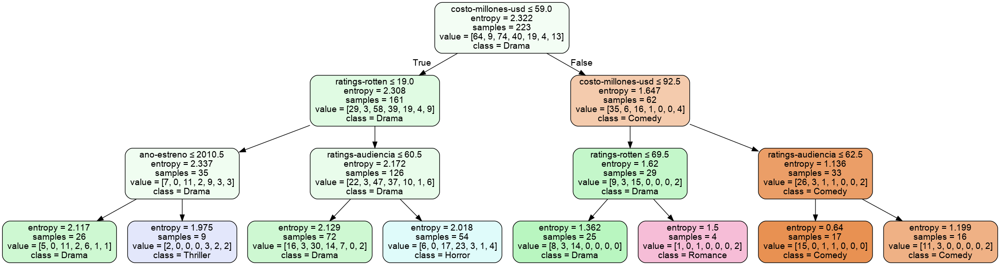

# Árbol de Decisiones


```python
import pandas as pd
from sklearn.tree import DecisionTreeClassifier # Importar el Clasificador
from sklearn.model_selection import train_test_split # Importar funciones de partición
from sklearn import metrics # Importar las métricas de scikit-learn
```


```python
from sklearn.tree import export_graphviz
from six import StringIO
from IPython.display import Image
import pydotplus
import os
```


```python
df = pd.read_csv('rating-peliculas.csv')
df
```


<div>
<style scoped>
    .dataframe tbody tr th:only-of-type {
        vertical-align: middle;
    }

    .dataframe tbody tr th {
        vertical-align: top;
    }

    .dataframe thead th {
        text-align: right;
    }
</style>
<table border="1" class="dataframe">
  <thead>
    <tr style="text-align: right;">
      <th></th>
      <th>pelicula</th>
      <th>genero</th>
      <th>ratings-rotten</th>
      <th>ratings-audiencia</th>
      <th>costo-millones-usd</th>
      <th>ano-estreno</th>
    </tr>
  </thead>
  <tbody>
    <tr>
      <th>0</th>
      <td>(500) Days of Summer</td>
      <td>Comedy</td>
      <td>87</td>
      <td>81</td>
      <td>8</td>
      <td>2009</td>
    </tr>
    <tr>
      <th>1</th>
      <td>10,000 B.C.</td>
      <td>Adventure</td>
      <td>9</td>
      <td>44</td>
      <td>105</td>
      <td>2008</td>
    </tr>
    <tr>
      <th>2</th>
      <td>12 Rounds</td>
      <td>Action</td>
      <td>30</td>
      <td>52</td>
      <td>20</td>
      <td>2009</td>
    </tr>
    <tr>
      <th>3</th>
      <td>127 Hours</td>
      <td>Adventure</td>
      <td>93</td>
      <td>84</td>
      <td>18</td>
      <td>2010</td>
    </tr>
    <tr>
      <th>4</th>
      <td>17 Again</td>
      <td>Comedy</td>
      <td>55</td>
      <td>70</td>
      <td>20</td>
      <td>2009</td>
    </tr>
    <tr>
      <th>...</th>
      <td>...</td>
      <td>...</td>
      <td>...</td>
      <td>...</td>
      <td>...</td>
      <td>...</td>
    </tr>
    <tr>
      <th>554</th>
      <td>Your Highness</td>
      <td>Comedy</td>
      <td>26</td>
      <td>36</td>
      <td>50</td>
      <td>2011</td>
    </tr>
    <tr>
      <th>555</th>
      <td>Youth in Revolt</td>
      <td>Comedy</td>
      <td>68</td>
      <td>52</td>
      <td>18</td>
      <td>2009</td>
    </tr>
    <tr>
      <th>556</th>
      <td>Zodiac</td>
      <td>Thriller</td>
      <td>89</td>
      <td>73</td>
      <td>65</td>
      <td>2007</td>
    </tr>
    <tr>
      <th>557</th>
      <td>Zombieland</td>
      <td>Action</td>
      <td>90</td>
      <td>87</td>
      <td>24</td>
      <td>2009</td>
    </tr>
    <tr>
      <th>558</th>
      <td>Zookeeper</td>
      <td>Comedy</td>
      <td>14</td>
      <td>42</td>
      <td>80</td>
      <td>2011</td>
    </tr>
  </tbody>
</table>
<p>559 rows × 6 columns</p>
</div>


```python
df.describe()
```


<div>
<style scoped>
    .dataframe tbody tr th:only-of-type {
        vertical-align: middle;
    }

    .dataframe tbody tr th {
        vertical-align: top;
    }

    .dataframe thead th {
        text-align: right;
    }
</style>
<table border="1" class="dataframe">
  <thead>
    <tr style="text-align: right;">
      <th></th>
      <th>ratings-rotten</th>
      <th>ratings-audiencia</th>
      <th>costo-millones-usd</th>
      <th>ano-estreno</th>
    </tr>
  </thead>
  <tbody>
    <tr>
      <th>count</th>
      <td>559.000000</td>
      <td>559.000000</td>
      <td>559.000000</td>
      <td>559.000000</td>
    </tr>
    <tr>
      <th>mean</th>
      <td>47.309481</td>
      <td>58.744186</td>
      <td>50.236136</td>
      <td>2009.152057</td>
    </tr>
    <tr>
      <th>std</th>
      <td>26.413091</td>
      <td>16.826887</td>
      <td>48.731817</td>
      <td>1.362632</td>
    </tr>
    <tr>
      <th>min</th>
      <td>0.000000</td>
      <td>0.000000</td>
      <td>0.000000</td>
      <td>2007.000000</td>
    </tr>
    <tr>
      <th>25%</th>
      <td>25.000000</td>
      <td>47.000000</td>
      <td>20.000000</td>
      <td>2008.000000</td>
    </tr>
    <tr>
      <th>50%</th>
      <td>46.000000</td>
      <td>58.000000</td>
      <td>35.000000</td>
      <td>2009.000000</td>
    </tr>
    <tr>
      <th>75%</th>
      <td>70.000000</td>
      <td>72.000000</td>
      <td>65.000000</td>
      <td>2010.000000</td>
    </tr>
    <tr>
      <th>max</th>
      <td>97.000000</td>
      <td>96.000000</td>
      <td>300.000000</td>
      <td>2011.000000</td>
    </tr>
  </tbody>
</table>
</div>


```python
y = df.genero
y.value_counts()
```


    Comedy       172
    Action       154
    Drama        101
    Horror        49
    Thriller      36
    Adventure     29
    Romance       18
    Name: genero, dtype: int64


```python
len(y)
```


    559


```python
X = df.drop(['pelicula', 'genero'], axis = 1)
```


```python
 # Dividir la muestra para poder probar el desempeño del modelo en 2 partes.
# Se divide en X y en Y. Esto es una parte de la base que el modelo nunca verá y que nos permitirá probar con más certeza el desempeño del modelo.
X_train,X_test, y_train, y_test = train_test_split(X, y, test_size = 0.6, random_state = 1)
```


```python
# clf = classifier
clf = DecisionTreeClassifier(criterion = 'entropy', max_depth = 3)
clf = clf.fit(X_train, y_train)
y_pred = clf.predict(X_test)
y_pred
```


    array(['Drama', 'Drama', 'Action', 'Drama', 'Comedy', 'Action', 'Comedy',
           'Comedy', 'Drama', 'Comedy', 'Drama', 'Drama', 'Comedy', 'Drama',
           'Drama', 'Comedy', 'Drama', 'Drama', 'Action', 'Drama', 'Action',
           'Comedy', 'Comedy', 'Drama', 'Comedy', 'Comedy', 'Drama', 'Drama',
           'Drama', 'Comedy', 'Drama', 'Action', 'Drama', 'Comedy', 'Action',
           'Drama', 'Thriller', 'Comedy', 'Action', 'Comedy', 'Action',
           'Comedy', 'Drama', 'Comedy', 'Comedy', 'Drama', 'Drama', 'Action',
           'Action', 'Drama', 'Comedy', 'Drama', 'Comedy', 'Thriller',
           'Drama', 'Comedy', 'Comedy', 'Comedy', 'Drama', 'Drama', 'Drama',
           'Comedy', 'Comedy', 'Action', 'Drama', 'Action', 'Action', 'Drama',
           'Drama', 'Drama', 'Comedy', 'Comedy', 'Drama', 'Comedy',
           'Thriller', 'Comedy', 'Comedy', 'Action', 'Thriller', 'Comedy',
           'Comedy', 'Drama', 'Drama', 'Drama', 'Thriller', 'Comedy', 'Drama',
           'Action', 'Drama', 'Comedy', 'Drama', 'Drama', 'Action', 'Drama',
           'Comedy', 'Comedy', 'Action', 'Action', 'Drama', 'Comedy',
           'Comedy', 'Comedy', 'Drama', 'Action', 'Drama', 'Comedy',
           'Thriller', 'Horror', 'Comedy', 'Comedy', 'Action', 'Drama',
           'Comedy', 'Comedy', 'Drama', 'Drama', 'Comedy', 'Drama', 'Comedy',
           'Comedy', 'Comedy', 'Action', 'Comedy', 'Comedy', 'Comedy',
           'Comedy', 'Comedy', 'Drama', 'Comedy', 'Thriller', 'Drama',
           'Drama', 'Comedy', 'Drama', 'Action', 'Comedy', 'Action', 'Comedy',
           'Drama', 'Comedy', 'Comedy', 'Comedy', 'Comedy', 'Drama', 'Comedy',
           'Drama', 'Comedy', 'Action', 'Comedy', 'Drama', 'Drama', 'Drama',
           'Comedy', 'Comedy', 'Comedy', 'Action', 'Drama', 'Comedy', 'Drama',
           'Comedy', 'Action', 'Comedy', 'Comedy', 'Thriller', 'Drama',
           'Comedy', 'Comedy', 'Comedy', 'Comedy', 'Drama', 'Comedy', 'Drama',
           'Thriller', 'Action', 'Comedy', 'Comedy', 'Comedy', 'Comedy',
           'Comedy', 'Comedy', 'Comedy', 'Drama', 'Comedy', 'Drama', 'Action',
           'Action', 'Drama', 'Comedy', 'Comedy', 'Comedy', 'Comedy',
           'Comedy', 'Drama', 'Comedy', 'Comedy', 'Comedy', 'Drama', 'Drama',
           'Comedy', 'Drama', 'Action', 'Action', 'Comedy', 'Drama', 'Drama',
           'Drama', 'Drama', 'Drama', 'Comedy', 'Drama', 'Comedy', 'Thriller',
           'Comedy', 'Comedy', 'Comedy', 'Comedy', 'Comedy', 'Action',
           'Drama', 'Comedy', 'Drama', 'Drama', 'Comedy', 'Comedy', 'Comedy',
           'Action', 'Drama', 'Drama', 'Comedy', 'Horror', 'Comedy', 'Action',
           'Action', 'Drama', 'Drama', 'Comedy', 'Drama', 'Comedy', 'Comedy',
           'Comedy', 'Comedy', 'Drama', 'Comedy', 'Drama', 'Comedy', 'Comedy',
           'Comedy', 'Drama', 'Comedy', 'Comedy', 'Comedy', 'Drama', 'Comedy',
           'Drama', 'Action', 'Comedy', 'Comedy', 'Comedy', 'Action', 'Drama',
           'Comedy', 'Comedy', 'Comedy', 'Comedy', 'Drama', 'Comedy', 'Drama',
           'Comedy', 'Drama', 'Drama', 'Comedy', 'Action', 'Action', 'Comedy',
           'Comedy', 'Drama', 'Drama', 'Comedy', 'Drama', 'Action', 'Comedy',
           'Comedy', 'Action', 'Drama', 'Comedy', 'Comedy', 'Comedy',
           'Comedy', 'Drama', 'Action', 'Comedy', 'Comedy', 'Comedy', 'Drama',
           'Action', 'Action', 'Comedy', 'Drama', 'Comedy', 'Comedy',
           'Comedy', 'Comedy', 'Comedy', 'Comedy', 'Drama', 'Drama', 'Comedy',
           'Comedy', 'Comedy', 'Comedy', 'Drama', 'Comedy', 'Comedy',
           'Comedy', 'Comedy', 'Comedy', 'Action', 'Drama', 'Drama', 'Action',
           'Drama', 'Action', 'Comedy', 'Drama', 'Comedy', 'Comedy', 'Drama',
           'Drama', 'Comedy', 'Drama', 'Comedy', 'Thriller', 'Comedy',
           'Comedy', 'Comedy', 'Drama'], dtype=object)


```python
# StringIO nos va a permitir establecer las reglas del árbol de decisión que generamos en strings.
dot_data = StringIO()
# Después usamos la función export_graphviz, sobre él vamos a pasar el árbol de decisión entrenado y un outfile, que utilizará el dot_data generado anteriormente.
# filled y rounded son parámetros de visualización.
export_graphviz(clf, out_file = dot_data, filled = True, rounded = True,
                special_characters = True, feature_names = X.columns, class_names = y.value_counts().index)

graph = pydotplus.graph_from_dot_data(dot_data.getvalue())
graph.write_png('Películas.png')
Image(graph.create_png())
```





```python
metrics.accuracy_score(y_test, y_pred)
```


    0.39285714285714285


Este modelo entrenado solo puede predecir correctamente un 39.3% de la variable aleatoria y, que es el genero de la película.
