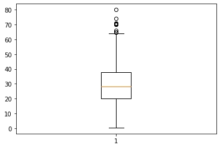
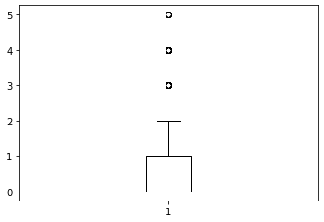
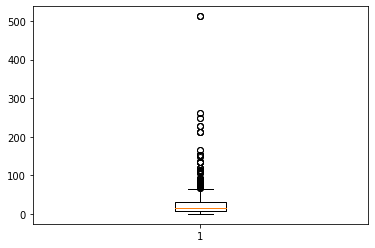
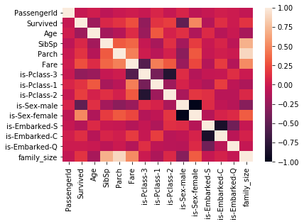
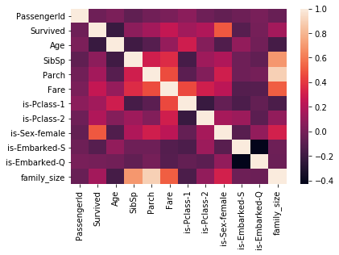

# Proyecto


```python
import pandas as pd
import numpy as np
import seaborn as sns
import os

import matplotlib.pyplot as plt
%matplotlib inline
```


```python
os.getcwd()
```


    '/home/oscar-dev/Platzimaster/Week11/CursoFundamentosDeEstadisticaYAnalisisDeDatosConPython/scripts/6-caracterizar-informacion-analisis-exploratorio/1-proyecto-analisis-exploratorio'


```python
path = '/home/oscar-dev/Platzimaster/Week11/CursoFundamentosDeEstadisticaYAnalisisDeDatosConPython/scripts/6-caracterizar-informacion-analisis-exploratorio/proyecto-titanic'
```


```python
# os.mkdir(path)
os.chdir(path)
```


```python
os.getcwd()
```


    '/home/oscar-dev/Platzimaster/Week11/CursoFundamentosDeEstadisticaYAnalisisDeDatosConPython/scripts/6-caracterizar-informacion-analisis-exploratorio/proyecto-titanic'


```python
df = pd.read_csv('train.csv')
df
```


<div>
<style scoped>
    .dataframe tbody tr th:only-of-type {
        vertical-align: middle;
    }

    .dataframe tbody tr th {
        vertical-align: top;
    }

    .dataframe thead th {
        text-align: right;
    }
</style>
<table border="1" class="dataframe">
  <thead>
    <tr style="text-align: right;">
      <th></th>
      <th>PassengerId</th>
      <th>Survived</th>
      <th>Pclass</th>
      <th>Name</th>
      <th>Sex</th>
      <th>Age</th>
      <th>SibSp</th>
      <th>Parch</th>
      <th>Ticket</th>
      <th>Fare</th>
      <th>Cabin</th>
      <th>Embarked</th>
    </tr>
  </thead>
  <tbody>
    <tr>
      <th>0</th>
      <td>1</td>
      <td>0</td>
      <td>3</td>
      <td>Braund, Mr. Owen Harris</td>
      <td>male</td>
      <td>22.0</td>
      <td>1</td>
      <td>0</td>
      <td>A/5 21171</td>
      <td>7.2500</td>
      <td>NaN</td>
      <td>S</td>
    </tr>
    <tr>
      <th>1</th>
      <td>2</td>
      <td>1</td>
      <td>1</td>
      <td>Cumings, Mrs. John Bradley (Florence Briggs Th...</td>
      <td>female</td>
      <td>38.0</td>
      <td>1</td>
      <td>0</td>
      <td>PC 17599</td>
      <td>71.2833</td>
      <td>C85</td>
      <td>C</td>
    </tr>
    <tr>
      <th>2</th>
      <td>3</td>
      <td>1</td>
      <td>3</td>
      <td>Heikkinen, Miss. Laina</td>
      <td>female</td>
      <td>26.0</td>
      <td>0</td>
      <td>0</td>
      <td>STON/O2. 3101282</td>
      <td>7.9250</td>
      <td>NaN</td>
      <td>S</td>
    </tr>
    <tr>
      <th>3</th>
      <td>4</td>
      <td>1</td>
      <td>1</td>
      <td>Futrelle, Mrs. Jacques Heath (Lily May Peel)</td>
      <td>female</td>
      <td>35.0</td>
      <td>1</td>
      <td>0</td>
      <td>113803</td>
      <td>53.1000</td>
      <td>C123</td>
      <td>S</td>
    </tr>
    <tr>
      <th>4</th>
      <td>5</td>
      <td>0</td>
      <td>3</td>
      <td>Allen, Mr. William Henry</td>
      <td>male</td>
      <td>35.0</td>
      <td>0</td>
      <td>0</td>
      <td>373450</td>
      <td>8.0500</td>
      <td>NaN</td>
      <td>S</td>
    </tr>
    <tr>
      <th>...</th>
      <td>...</td>
      <td>...</td>
      <td>...</td>
      <td>...</td>
      <td>...</td>
      <td>...</td>
      <td>...</td>
      <td>...</td>
      <td>...</td>
      <td>...</td>
      <td>...</td>
      <td>...</td>
    </tr>
    <tr>
      <th>886</th>
      <td>887</td>
      <td>0</td>
      <td>2</td>
      <td>Montvila, Rev. Juozas</td>
      <td>male</td>
      <td>27.0</td>
      <td>0</td>
      <td>0</td>
      <td>211536</td>
      <td>13.0000</td>
      <td>NaN</td>
      <td>S</td>
    </tr>
    <tr>
      <th>887</th>
      <td>888</td>
      <td>1</td>
      <td>1</td>
      <td>Graham, Miss. Margaret Edith</td>
      <td>female</td>
      <td>19.0</td>
      <td>0</td>
      <td>0</td>
      <td>112053</td>
      <td>30.0000</td>
      <td>B42</td>
      <td>S</td>
    </tr>
    <tr>
      <th>888</th>
      <td>889</td>
      <td>0</td>
      <td>3</td>
      <td>Johnston, Miss. Catherine Helen "Carrie"</td>
      <td>female</td>
      <td>NaN</td>
      <td>1</td>
      <td>2</td>
      <td>W./C. 6607</td>
      <td>23.4500</td>
      <td>NaN</td>
      <td>S</td>
    </tr>
    <tr>
      <th>889</th>
      <td>890</td>
      <td>1</td>
      <td>1</td>
      <td>Behr, Mr. Karl Howell</td>
      <td>male</td>
      <td>26.0</td>
      <td>0</td>
      <td>0</td>
      <td>111369</td>
      <td>30.0000</td>
      <td>C148</td>
      <td>C</td>
    </tr>
    <tr>
      <th>890</th>
      <td>891</td>
      <td>0</td>
      <td>3</td>
      <td>Dooley, Mr. Patrick</td>
      <td>male</td>
      <td>32.0</td>
      <td>0</td>
      <td>0</td>
      <td>370376</td>
      <td>7.7500</td>
      <td>NaN</td>
      <td>Q</td>
    </tr>
  </tbody>
</table>
<p>891 rows × 12 columns</p>
</div>


```python
df.isna().sum(axis = 0)/len(df)
```


    PassengerId    0.000000
    Survived       0.000000
    Pclass         0.000000
    Name           0.000000
    Sex            0.000000
    Age            0.198653
    SibSp          0.000000
    Parch          0.000000
    Ticket         0.000000
    Fare           0.000000
    Cabin          0.771044
    Embarked       0.002245
    dtype: float64


```python
df.drop(['Cabin'], axis = 1)
```


<div>
<style scoped>
    .dataframe tbody tr th:only-of-type {
        vertical-align: middle;
    }

    .dataframe tbody tr th {
        vertical-align: top;
    }

    .dataframe thead th {
        text-align: right;
    }
</style>
<table border="1" class="dataframe">
  <thead>
    <tr style="text-align: right;">
      <th></th>
      <th>PassengerId</th>
      <th>Survived</th>
      <th>Pclass</th>
      <th>Name</th>
      <th>Sex</th>
      <th>Age</th>
      <th>SibSp</th>
      <th>Parch</th>
      <th>Ticket</th>
      <th>Fare</th>
      <th>Embarked</th>
    </tr>
  </thead>
  <tbody>
    <tr>
      <th>0</th>
      <td>1</td>
      <td>0</td>
      <td>3</td>
      <td>Braund, Mr. Owen Harris</td>
      <td>male</td>
      <td>22.0</td>
      <td>1</td>
      <td>0</td>
      <td>A/5 21171</td>
      <td>7.2500</td>
      <td>S</td>
    </tr>
    <tr>
      <th>1</th>
      <td>2</td>
      <td>1</td>
      <td>1</td>
      <td>Cumings, Mrs. John Bradley (Florence Briggs Th...</td>
      <td>female</td>
      <td>38.0</td>
      <td>1</td>
      <td>0</td>
      <td>PC 17599</td>
      <td>71.2833</td>
      <td>C</td>
    </tr>
    <tr>
      <th>2</th>
      <td>3</td>
      <td>1</td>
      <td>3</td>
      <td>Heikkinen, Miss. Laina</td>
      <td>female</td>
      <td>26.0</td>
      <td>0</td>
      <td>0</td>
      <td>STON/O2. 3101282</td>
      <td>7.9250</td>
      <td>S</td>
    </tr>
    <tr>
      <th>3</th>
      <td>4</td>
      <td>1</td>
      <td>1</td>
      <td>Futrelle, Mrs. Jacques Heath (Lily May Peel)</td>
      <td>female</td>
      <td>35.0</td>
      <td>1</td>
      <td>0</td>
      <td>113803</td>
      <td>53.1000</td>
      <td>S</td>
    </tr>
    <tr>
      <th>4</th>
      <td>5</td>
      <td>0</td>
      <td>3</td>
      <td>Allen, Mr. William Henry</td>
      <td>male</td>
      <td>35.0</td>
      <td>0</td>
      <td>0</td>
      <td>373450</td>
      <td>8.0500</td>
      <td>S</td>
    </tr>
    <tr>
      <th>...</th>
      <td>...</td>
      <td>...</td>
      <td>...</td>
      <td>...</td>
      <td>...</td>
      <td>...</td>
      <td>...</td>
      <td>...</td>
      <td>...</td>
      <td>...</td>
      <td>...</td>
    </tr>
    <tr>
      <th>886</th>
      <td>887</td>
      <td>0</td>
      <td>2</td>
      <td>Montvila, Rev. Juozas</td>
      <td>male</td>
      <td>27.0</td>
      <td>0</td>
      <td>0</td>
      <td>211536</td>
      <td>13.0000</td>
      <td>S</td>
    </tr>
    <tr>
      <th>887</th>
      <td>888</td>
      <td>1</td>
      <td>1</td>
      <td>Graham, Miss. Margaret Edith</td>
      <td>female</td>
      <td>19.0</td>
      <td>0</td>
      <td>0</td>
      <td>112053</td>
      <td>30.0000</td>
      <td>S</td>
    </tr>
    <tr>
      <th>888</th>
      <td>889</td>
      <td>0</td>
      <td>3</td>
      <td>Johnston, Miss. Catherine Helen "Carrie"</td>
      <td>female</td>
      <td>NaN</td>
      <td>1</td>
      <td>2</td>
      <td>W./C. 6607</td>
      <td>23.4500</td>
      <td>S</td>
    </tr>
    <tr>
      <th>889</th>
      <td>890</td>
      <td>1</td>
      <td>1</td>
      <td>Behr, Mr. Karl Howell</td>
      <td>male</td>
      <td>26.0</td>
      <td>0</td>
      <td>0</td>
      <td>111369</td>
      <td>30.0000</td>
      <td>C</td>
    </tr>
    <tr>
      <th>890</th>
      <td>891</td>
      <td>0</td>
      <td>3</td>
      <td>Dooley, Mr. Patrick</td>
      <td>male</td>
      <td>32.0</td>
      <td>0</td>
      <td>0</td>
      <td>370376</td>
      <td>7.7500</td>
      <td>Q</td>
    </tr>
  </tbody>
</table>
<p>891 rows × 11 columns</p>
</div>


```python
df = df[df.Age.notna()]
df.columns
```


    Index(['PassengerId', 'Survived', 'Pclass', 'Name', 'Sex', 'Age', 'SibSp',
           'Parch', 'Ticket', 'Fare', 'Cabin', 'Embarked'],
          dtype='object')


```python
vars_disc = ['Survived', 'Pclass', 'Sex', 'SibSp', 'Parch', 'Embarked']
for i in vars_disc:
    print(df[i].value_counts())
    
# Se itera sobre estas variables para entender el contenido de cada una de ellas.
```

    0    424
    1    290
    Name: Survived, dtype: int64
    3    355
    1    186
    2    173
    Name: Pclass, dtype: int64
    male      453
    female    261
    Name: Sex, dtype: int64
    0    471
    1    183
    2     25
    4     18
    3     12
    5      5
    Name: SibSp, dtype: int64
    0    521
    1    110
    2     68
    5      5
    3      5
    4      4
    6      1
    Name: Parch, dtype: int64
    S    554
    C    130
    Q     28
    Name: Embarked, dtype: int64


```python
vars_cat = ['Pclass', 'Sex', 'Embarked']
# One hot encoding es un proceso en el que la variable categorica se expresa como un 1 o 0 dentro de las categorías que tiene cada variable
#def one_hot():
for i in vars_cat:
    categorias = df[i].value_counts().index

    print(categorias)
    for j in categorias:
        name = 'is-'+str(i)+'-'+str(j)
        print(name)
        df[name] = np.where(df[i] == j, 1, 0)

    df = df.drop([i], axis= 1)
```

    Int64Index([3, 1, 2], dtype='int64')
    is-Pclass-3
    is-Pclass-1
    is-Pclass-2
    Index(['male', 'female'], dtype='object')
    is-Sex-male
    is-Sex-female
    Index(['S', 'C', 'Q'], dtype='object')
    is-Embarked-S
    is-Embarked-C
    is-Embarked-Q


    /home/oscar-dev/anaconda3/lib/python3.7/site-packages/ipykernel_launcher.py:11: SettingWithCopyWarning: 
    A value is trying to be set on a copy of a slice from a DataFrame.
    Try using .loc[row_indexer,col_indexer] = value instead
    
    See the caveats in the documentation: https://pandas.pydata.org/pandas-docs/stable/user_guide/indexing.html#returning-a-view-versus-a-copy
      # This is added back by InteractiveShellApp.init_path()


```python
# Outliers - Tarea
y = df['Age']
fig, axis = plt.subplots()
axis.boxplot(x = y)
```


    {'whiskers': [<matplotlib.lines.Line2D at 0x7f72136ac850>,
      <matplotlib.lines.Line2D at 0x7f721363da10>],
     'caps': [<matplotlib.lines.Line2D at 0x7f721363df10>,
      <matplotlib.lines.Line2D at 0x7f7216f3e2d0>],
     'boxes': [<matplotlib.lines.Line2D at 0x7f72136ac810>],
     'medians': [<matplotlib.lines.Line2D at 0x7f721364b990>],
     'fliers': [<matplotlib.lines.Line2D at 0x7f721364be90>],
     'means': []}





```python
# df['Age'].describe()
# Primer outlier, edad, personas mayores a 60 años.
df = df.drop(df[df['Age'] > 60].index)
```


```python
y = df['SibSp']
fig, axis = plt.subplots()
axis.boxplot(x = y)
```


    {'whiskers': [<matplotlib.lines.Line2D at 0x7f72135d6a90>,
      <matplotlib.lines.Line2D at 0x7f72135cae50>],
     'caps': [<matplotlib.lines.Line2D at 0x7f72135dc590>,
      <matplotlib.lines.Line2D at 0x7f72135dca90>],
     'boxes': [<matplotlib.lines.Line2D at 0x7f72135cae10>],
     'medians': [<matplotlib.lines.Line2D at 0x7f72135dcfd0>],
     'fliers': [<matplotlib.lines.Line2D at 0x7f7213e6e050>],
     'means': []}





```python
df['SibSp'].describe()
```


    count    692.000000
    mean       0.524566
    std        0.940011
    min        0.000000
    25%        0.000000
    50%        0.000000
    75%        1.000000
    max        5.000000
    Name: SibSp, dtype: float64


```python
df = df.drop(df[df['SibSp'] > 2].index)
```


```python
y = df['Fare']
fig, axis = plt.subplots()
axis.boxplot(x = y)
df['Fare'].describe()
```


    count    657.000000
    mean      33.566425
    std       51.979076
    min        0.000000
    25%        8.050000
    50%       14.454200
    75%       31.000000
    max      512.329200
    Name: Fare, dtype: float64





```python
df = df.drop(df[df['Fare'] > 50].index)
```


```python
df.columns
```


    Index(['PassengerId', 'Survived', 'Name', 'Age', 'SibSp', 'Parch', 'Ticket',
           'Fare', 'Cabin', 'is-Pclass-3', 'is-Pclass-1', 'is-Pclass-2',
           'is-Sex-male', 'is-Sex-female', 'is-Embarked-S', 'is-Embarked-C',
           'is-Embarked-Q'],
          dtype='object')


```python
df['family_size'] = df['SibSp'] + df['Parch']
```


```python
corr = df.corr()
sns.heatmap(corr, yticklabels=corr.columns, xticklabels=corr.columns)
```


    <matplotlib.axes._subplots.AxesSubplot at 0x7f7213510990>





```python
df = df.drop(['is-Pclass-3', 'is-Sex-male', 'is-Embarked-C'], axis = 1)
```


```python
corr = df.corr()
sns.heatmap(corr, yticklabels=corr.columns, xticklabels=corr.columns)
```


    <matplotlib.axes._subplots.AxesSubplot at 0x7f7215f66310>




