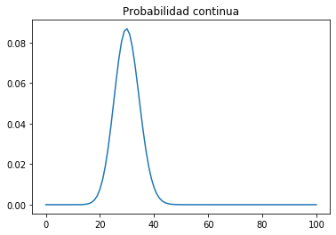

```python
import scipy.stats
import numpy as np
import pandas as pd
import matplotlib.pyplot as plt
import seaborn as sns
%matplotlib inline
```


```python
from scipy.stats import binom

# Entre más grande el valor de N, más continua se verá la función de distribución y podrá aproximar mejor una variable continua
N = 100
x = list(range(0, N+1, 1))
y = list([])

for i in x:
    y.append(binom.pmf(i,p=0.3,n=N))
    
fig, axis = plt.subplots()
axis.plot(x, y)
axis.set_title('Probabilidad continua')
```


    Text(0.5, 1.0, 'Probabilidad continua')





```python
from scipy.stats import binom

# Entre más grande el valor de N, más continua se verá la función de distribución y podrá aproximar mejor una variable continua
N = 100
x = list(range(0, N+1, 1))
y = list([])

for i in x:
    y.append(binom.cdf(i, p=0.3,n=N))

fig, axis = plt.subplots()
axis.plot(x, y)
axis.set_title('Probabilidad acumulada')
```


    Text(0.5, 1.0, 'Probabilidad acumulada')


```python
from scipy.stats import norm

# skew: asimetría, var: varianza, kurt: curtosis

mean, var, skew, kurt = norm.stats(moments = 'mvsk')
print(mean)
print(var)
print(skew)
print(kurt)
```

    0.0
    1.0
    0.0
    0.0

