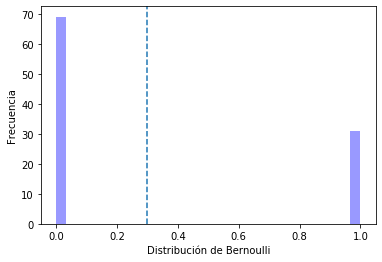
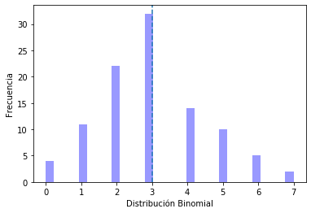
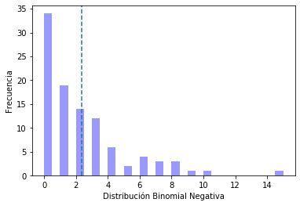
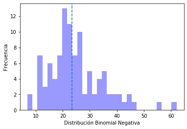
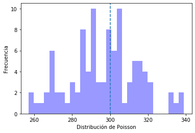

```python
import matplotlib.pyplot as plt
%matplotlib inline
```

# Distribución de Bernoulli


```python
from scipy.stats import bernoulli
p = 0.3
data = bernoulli.rvs(p, size=100)
```


```python
len(data)
```


    100


```python
mean, var, skew, kurt = bernoulli.stats(p, moments='mvsk')
mean, var, skew, kurt
```


    (array(0.3), array(0.21), array(0.87287156), array(-1.23809524))


```python
import seaborn as sns
axis = sns.distplot(data, bins = 30, kde = False, color='blue')
# Definimos los ejes
axis.set(xlabel='Distribución de Bernoulli', ylabel='Frecuencia')

# Mostramos las medidas de tendencia central
axis.axvline(x=mean, linestyle='--', label='Media')
```


    <matplotlib.lines.Line2D at 0x7ff4d8c68850>





# Distribución Binomial


```python
from scipy.stats import binom
p = 0.3
n = 10
data = binom.rvs(p=p, n=n, size=100)
data
```


    array([0, 3, 4, 6, 2, 2, 6, 4, 2, 2, 1, 1, 5, 3, 2, 3, 4, 6, 4, 3, 1, 4,
           1, 3, 0, 2, 5, 3, 5, 2, 2, 2, 2, 2, 3, 4, 7, 1, 3, 5, 3, 3, 2, 3,
           3, 1, 3, 3, 1, 3, 3, 3, 4, 2, 6, 1, 3, 3, 1, 5, 4, 4, 2, 3, 5, 5,
           6, 4, 5, 2, 3, 3, 3, 5, 4, 2, 2, 2, 3, 4, 3, 2, 4, 4, 2, 2, 3, 3,
           7, 3, 5, 3, 1, 2, 3, 0, 0, 1, 3, 3])


```python
mean, var, skew, kurt = binom.stats(p=p,n=n, moments='mvsk')
mean, var, skew, kurt
```


    (array(3.), array(2.1), array(0.27602622), array(-0.12380952))


```python
import seaborn as sns
axis = sns.distplot(data, bins = 30, kde = False, color='blue')
# Definimos los ejes
axis.set(xlabel='Distribución Binomial', ylabel='Frecuencia')

# Mostramos las medidas de tendencia central
axis.axvline(x=mean, linestyle='--', label='Media')
```


    <matplotlib.lines.Line2D at 0x7ff4d8b9aa50>





# Distribución binomial Negativa


```python
from scipy.stats import nbinom
p = 0.3
n = 1
data = nbinom.rvs(p=p, n=n, size=100)
data
```


    array([ 3,  0,  1,  2,  1,  0,  1,  0,  1,  2,  2,  1,  0,  8,  1,  2,  8,
            1,  2,  1,  4,  3,  2,  0,  4,  5,  2,  0,  0,  1,  3,  0,  0,  1,
            8,  0,  7,  3,  1,  3,  6,  6,  3,  0,  0,  2,  3,  0,  0,  1,  3,
            2,  0,  2,  0,  0,  0,  0,  0,  6,  1,  0,  0,  7,  0,  0,  3,  1,
            9,  2, 15, 10,  3,  4,  0,  1,  0,  0,  0,  1,  4,  1,  3,  1,  5,
            2,  6,  2,  1,  4,  0,  4,  0,  0,  0,  0,  3,  2,  7,  0])


```python
mean, var, skew, kurt = nbinom.stats(p=p,n=n, moments='mvsk')
mean, var, skew, kurt
```


    (array(2.33333333), array(7.77777778), array(2.03188864), array(6.12857143))


```python
import seaborn as sns
axis = sns.distplot(data, bins = 30, kde = False, color='blue')
# Definimos los ejes
axis.set(xlabel='Distribución Binomial Negativa', ylabel='Frecuencia')

# Mostramos las medidas de tendencia central
axis.axvline(x=mean, linestyle='--', label='Media')
```


    <matplotlib.lines.Line2D at 0x7ff4d89bab10>





```python
from scipy.stats import nbinom
p = 0.3
n = 10
data = nbinom.rvs(p=p, n=n, size=100)
data
```


    array([38, 56, 62, 27, 20, 18, 31, 26, 11, 15, 37, 17, 20, 16, 23, 18, 30,
           28, 13, 15, 31, 39, 16, 42, 25, 25, 21, 22, 21, 21, 35, 33, 36, 16,
           16, 21, 22, 22, 29, 20,  7, 24, 45, 22, 20, 18, 11, 11, 26, 35, 27,
           17, 11, 26, 36, 33, 28, 18, 39, 20, 23, 24, 23, 40, 21, 26, 26, 21,
           17, 22, 12, 24, 20, 34, 24, 34,  8, 36, 23, 27, 12, 29, 44, 27, 18,
           22, 14, 23, 11, 14, 40, 47, 30, 17, 30, 27, 20, 18, 18, 25])


```python
mean, var, skew, kurt = nbinom.stats(p=p,n=n, moments='mvsk')
mean, var, skew, kurt
```


    (array(23.33333333), array(77.77777778), array(0.6425396), array(0.61285714))


```python
import seaborn as sns
axis = sns.distplot(data, bins = 30, kde = False, color='blue')
# Definimos los ejes
axis.set(xlabel='Distribución Binomial Negativa', ylabel='Frecuencia')

# Mostramos las medidas de tendencia central
axis.axvline(x=mean, linestyle='--', label='Media')
```


    <matplotlib.lines.Line2D at 0x7ff4d870a090>





# Distribución de Poisson


```python
from scipy.stats import poisson
lambda_p = 300
data = poisson.rvs(mu=lambda_p, size=100)
data
```


    array([318, 296, 293, 335, 301, 312, 299, 337, 277, 290, 261, 287, 322,
           270, 283, 270, 303, 287, 311, 295, 306, 286, 292, 309, 301, 339,
           257, 331, 299, 291, 317, 271, 300, 286, 267, 304, 304, 275, 298,
           296, 289, 257, 290, 292, 304, 293, 300, 308, 315, 265, 319, 317,
           305, 289, 301, 306, 298, 289, 286, 292, 270, 300, 268, 315, 285,
           289, 318, 321, 269, 321, 318, 274, 286, 280, 300, 292, 286, 292,
           332, 312, 306, 281, 270, 273, 305, 314, 301, 290, 267, 284, 305,
           302, 311, 304, 316, 279, 312, 296, 313, 292])


```python
mean, var, skew, kurt = poisson.stats(mu=lambda_p, moments='mvsk')
mean, var, skew, kurt
```


    (array(300.), array(300.), array(0.05773503), array(0.00333333))


```python
import seaborn as sns
axis = sns.distplot(data, bins = 30, kde = False, color='blue')
# Definimos los ejes
axis.set(xlabel='Distribución de Poisson', ylabel='Frecuencia')

# Mostramos las medidas de tendencia central
axis.axvline(x=mean, linestyle='--', label='Media')
```


    <matplotlib.lines.Line2D at 0x7ff4d864f510>




