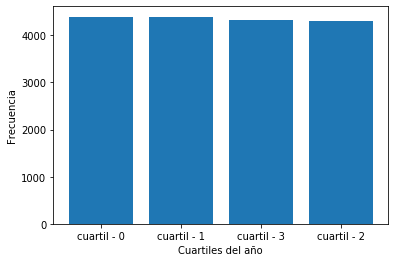
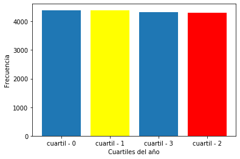
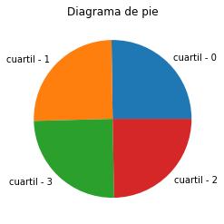
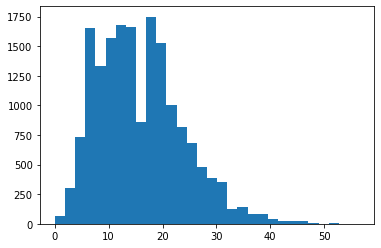
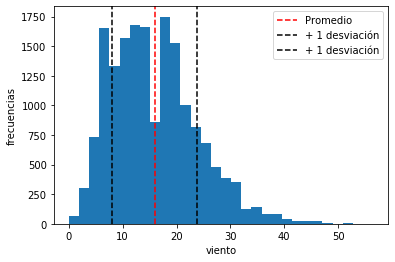

```python
import scipy.stats
import numpy as np
import pandas as pd

import matplotlib.pyplot as plt
import seaborn as sns

%matplotlib inline
```


```python
df = pd.read_csv('bicicletas-compartidas.csv')
```

# Variables categóricas


```python
df.columns
```


    Index(['fecha', 'bicis-compartidas', 'temp-obs', 'sens-temp', 'hum', 'viento',
           'codigo-clima', 'festivo', 'findesemana', 'cuartil-ano'],
          dtype='object')


```python
y = df['cuartil-ano'].apply(lambda x: 'cuartil - ' + str(int(x)))
```


```python
fig, axis = plt.subplots()
axis.bar(y.value_counts().index, y.value_counts())
axis.set_xlabel('Cuartiles del año')
axis.set_ylabel('Frecuencia')
```


    Text(0, 0.5, 'Frecuencia')





```python
fig, axis = plt.subplots()
axis.bar(y.value_counts().index, y.value_counts())
axis.set_xlabel('Cuartiles del año')
axis.set_ylabel('Frecuencia')
axis.patches[3].set_facecolor('red')
axis.patches[1].set_facecolor('yellow')
```





```python
# Gráfico de torta
fig, axis = plt.subplots()
axis.pie(y.value_counts(), labels = y.value_counts().index)
axis.set_title('Diagrama de pie')
```


    Text(0.5, 1.0, 'Diagrama de pie')





# Variables numéricas


```python
# Utilizaremos al viento como variable numérica
# Cómo se comportan los prestamos de la bicicleta con diferentes valores del viento
y = df['viento']
fig, axis = plt.subplots()
# bin hace referencia a cuántas particiones quiero que se haga en esta variable continua
axis.hist(y, bins = 30)
```


    (array([7.000e+01, 3.000e+02, 7.300e+02, 1.654e+03, 1.334e+03, 1.571e+03,
            1.676e+03, 1.666e+03, 8.560e+02, 1.749e+03, 1.529e+03, 1.007e+03,
            8.200e+02, 6.860e+02, 4.790e+02, 3.870e+02, 3.550e+02, 1.260e+02,
            1.390e+02, 8.100e+01, 8.000e+01, 4.000e+01, 2.600e+01, 2.000e+01,
            2.000e+01, 5.000e+00, 2.000e+00, 3.000e+00, 1.000e+00, 2.000e+00]),
     array([ 0.        ,  1.88333333,  3.76666667,  5.65      ,  7.53333333,
             9.41666667, 11.3       , 13.18333333, 15.06666667, 16.95      ,
            18.83333333, 20.71666667, 22.6       , 24.48333333, 26.36666667,
            28.25      , 30.13333333, 32.01666667, 33.9       , 35.78333333,
            37.66666667, 39.55      , 41.43333333, 43.31666667, 45.2       ,
            47.08333333, 48.96666667, 50.85      , 52.73333333, 54.61666667,
            56.5       ]),
     <a list of 30 Patch objects>)





```python
fig, axis = plt.subplots()
axis.hist(y, bins = 30)
axis.set_xlabel('viento')
axis.set_ylabel('frecuencias')

# Si no se definen los nombres de los labels, JAMÁS habríamos podido visualizarlos en la leyenda del gráfico
plt.axvline(np.mean(y), c = 'r', linestyle = '--', label = 'Promedio')
plt.axvline(np.mean(y)+np.std(y), c = 'k', linestyle = '--', label = '+ 1 desviación')
plt.axvline(np.mean(y)-np.std(y), c = 'k', linestyle = '--', label = '+ 1 desviación')
axis.legend()
```


    <matplotlib.legend.Legend at 0x7f2ec348ba90>




